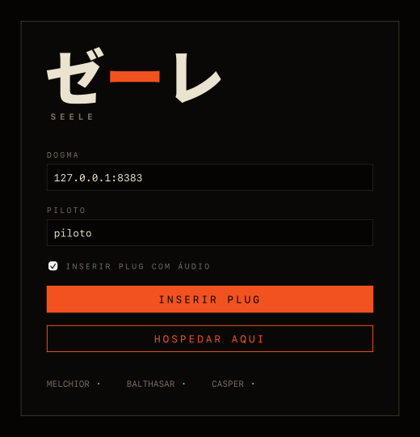

# SEELE

**Voz e texto auto-hospedados, com o terminal em primeiro lugar.**

Você sobe um servidor na sua máquina. Seus amigos conectam nele. Não existe
serviço no meio, não existe cadastro em lugar nenhum, e o cliente principal
roda inteiro no terminal — inclusive por SSH, num terminal de 16 cores.

Não é um clone de Discord com tema escuro. É a suposição oposta: o servidor é
seu, os dados são seus, e a interface de referência é aquela que cabe em 80×24.

---

## Como é por dentro

```text
   plug (terminal)          SEELE.app (desktop)
          │                        │
          └────────┬───────────────┘
                   │  seele-core — sessão, protocolo, áudio, estado
                   │  (nenhuma lógica vive nas interfaces)
                   ▼
             ── QUIC / TLS 1.3 ──
                   ▼
              seeled (o Dogma)
       MELCHIOR · BALTHASAR · CASPER
```

Um **Dogma** é uma instância do servidor: o banco dele, as contas dele, os
canais dele. Dentro de um Dogma há **Cages** (canais de voz) e **Linhas**
(canais de texto). Quem entra é um **Piloto**, e a qualidade da conexão dele
aparece como **Taxa de Sincronização** — um número de 0 a 100 sempre visível,
que é a diferença de caráter em relação a um cliente de conversa comum.

O vocabulário vem de Evangelion e não é decoração: ele nomeia módulo, binário e
variante de erro. `specs/07-tema-evangelion.md` e `docs/glossario.md`.

**A regra mais importante do projeto** é que toda a lógica mora em
`seele-core`, e as interfaces só traduzem evento em pixel e entrada em comando.
Não é convenção: `cargo xtask check-deps` quebra o build se uma casca tentar
enxergar o protocolo direto.

| | |
|---|---|
| Transporte | QUIC (`quinn`), TLS 1.3 obrigatório, uma porta **UDP** |
| Confiança | TOFU — o cliente fixa a chave no primeiro contato, modelo SSH |
| Voz | Opus 48 kHz mono, quadros de 20 ms, DTX, jitter buffer adaptativo |
| Identidade | par de chaves Ed25519, guardado em disco |
| Persistência | SQLite com migrações embutidas, no próprio binário |

---

## A interface

Retratos de verdade: saem do mesmo código que desenha no terminal, rodando
`cargo run --example telas -p seele-tui`. O que o texto não mostra é a cor — e
é de propósito que nada dependa dela.

### Em operação

```text
┌ SEELE ─ 同期率 ─ 第3新東京市 ─ 12:04:33 ─────────────────────────────────────┐
│┌ DOGMA ─────────┐┌ CAGES / LINHAS ──────┐┌ MENSAGENS ───────────────────────┐│
││▸ Terceira Tóqu…││▼ CAGE-01 CENTRAL     ││12:01 ayanami                     ││
││                ││  ● ayanami      █ 98%││  verificando harmônicos          ││
││                ││  ○ shinji       ▓ 71%││12:03 shinji                      ││
││                ││  ○ asuka   A.T. ▒ 44%││  sync caiu aqui                  ││
││                ││▶ CAGE-02 TESTE       ││12:04 você                        ││
││                ││─ LINHA #geral        ││  vendo — o jitter subiu junto    ││
││                ││─ LINHA #logs         ││                                  ││
││                ││                      ││                                  ││
││                ││                      ││                                  ││
││                ││                      ││                                  ││
││                ││                      ││                                  ││
││                ││                      ││                                  ││
││                ││                      ││                                  ││
││                ││                      ││                                  ││
││                ││                      ││                                  ││
││                ││                      ││                                  ││
││                ││                      ││                                  ││
││                ││                      ││                                  ││
││                ││                      ││▸ _                               ││
│└────────────────┘└──────────────────────┘└──────────────────────────────────┘│
│ NORMAL │ SYNC █ 94% │ RTT 38ms │ JIT 12ms │ LOSS 0.2% │ OPUS 32k │ A.T. OFF  │
└──────────────────────────────────────────────────────────────────────────────┘
```

Três painéis e uma barra de telemetria permanente. Ninguém precisa abrir menu
para saber que a conexão está ruim.

### Buscar no que foi dito

```text
┌ SEELE ─ 同期率 ─ 第3新東京市 ─ 12:04:33 ─────────────────────────────────────┐
│┌ DOGMA ─────────┐┌ CAGES / LINHAS ──────┐┌ MENSAGENS ───────────────────────┐│
││▸ Terceira Tóqu…││▼ CAGE-01 CENTRAL     ││12:01 ayanami                     ││
││                ││  ● ayanami      █ 98%││  verificando harmônicos          ││
││                ││  ○ shinji       ▓ 71%││12:03 shinji                      ││
││                ││  ○ asuka   A.T. ▒ 44%││  sync caiu aqui                  ││
││                ││▶ CAGE-02 TESTE       ││12:04 você                        ││
││                ││─ LINHA #geral        ││  vendo — o jitter subiu junto    ││
││                ││─ LINHA #logs         ││12:05 ayanami                     ││
││                ││                      ││  o sync voltou a subir           ││
││                ││                      ││12:06 asuka                       ││
││                ││                      ││  aqui o sync nem caiu            ││
││                ││                      ││                                  ││
││                ││                      ││                                  ││
││                ││                      ││                                  ││
││                ││                      ││                                  ││
││                ││                      ││                                  ││
││                ││                      ││                                  ││
││                ││                      ││                                  ││
││                ││                      ││                                  ││
││                ││                      ││/ sync_  [1/3]                    ││
│└────────────────┘└──────────────────────┘└──────────────────────────────────┘│
│ BUSCA │ SYNC █ 94% │ RTT 38ms │ JIT 12ms │ LOSS 0.2% │ OPUS 32k │ A.T. OFF   │
└──────────────────────────────────────────────────────────────────────────────┘
```

`/` busca no histórico e o contador anda enquanto se digita; `n` e `N` pulam
para a ocorrência seguinte e para a anterior, dando a volta nas duas pontas. A
ocorrência sob o cursor acende — e como esta página é texto, o realce não
aparece aqui. É por isso que o `[1/3]` existe: nenhuma informação desta
interface é transmitida só por cor.

### A ajuda cabe numa tela

```text
┌ SEELE ─ 同期率 ─ 第3新東京市 ─ 12:04:33 ─────────────────────────────────────┐
│┌ DOGMA ─────────┐┌ CAGES / LINHAS ──────┐┌ MENSAGENS ───────────────────────┐│
││▸ Terceira ┌ AJUDA ─────────────────────────────────────────────┐           ││
││           │h j k l / setas   navegar                           │s          ││
││           │Tab / Shift+Tab   alternar painel                   │           ││
││           │Enter             entrar no Cage / abrir Linha      │           ││
││           │i                 escrever mensagem                 │           ││
││           │Espaço (segurar)  falar                             │u junto    ││
││           │m                 A.T. Field (mudo)                 │           ││
││           │d                 isolamento total (surdo)          │           ││
││           │g / G             topo / fim                        │           ││
││           │/                 buscar no histórico               │           ││
││           │n / N             ocorrência seguinte / anterior    │           ││
││           │?                 esta ajuda                        │           ││
││           │:conectar <host>  conectar a um Dogma               │           ││
││           │:cage <nome>      entrar num Cage                   │           ││
││           │:sync             diagnóstico detalhado             │           ││
││           │:audio            dispositivos                      │           ││
││           │:ejetar           sair deste Dogma e escolher outro │           ││
││           │:q                sair do programa                  │           ││
││           └────────────────────────────────────────────────────┘           ││
│└────────────────┘└──────────────────────┘└──────────────────────────────────┘│
│ NORMAL │ SYNC █ 94% │ RTT 38ms │ JIT 12ms │ LOSS 0.2% │ OPUS 32k │ A.T. OFF  │
└──────────────────────────────────────────────────────────────────────────────┘
```

O critério de aceite é esse: alguém de fora do projeto consegue conectar e
conversar sabendo só a tecla `?`.

### Quando o enlace cai

```text
┌ SEELE ─ 同期率 ─ 第3新東京市 ─ 12:04:33 ─────────────────────────────────────┐
│警告 BATERIA INTERNA 04:47 · 3 tentativas                                     │
│警告 ENLACE PERDIDO                                                           │
│┌ DOGMA ─────────┐┌ CAGES / LINHAS ──────┐┌ MENSAGENS ───────────────────────┐│
││▸ Terceira Tóqu…││▼ CAGE-01 CENTRAL     ││12:01 ayanami                     ││
││                ││  ● ayanami      █ 98%││  verificando harmônicos          ││
││                ││  ○ shinji       ▓ 71%││12:03 shinji                      ││
││                ││  ○ asuka   A.T. ▒ 44%││  sync caiu aqui                  ││
││                ││▶ CAGE-02 TESTE       ││12:04 você                        ││
││                ││─ LINHA #geral        ││  vendo — o jitter subiu junto    ││
││                ││─ LINHA #logs         ││                                  ││
││                ││                      ││                                  ││
││                ││                      ││                                  ││
││                ││                      ││                                  ││
││                ││                      ││                                  ││
││                ││                      ││                                  ││
││                ││                      ││                                  ││
││                ││                      ││                                  ││
││                ││                      ││                                  ││
││                ││                      ││                                  ││
││                ││                      ││▸ _                               ││
│└────────────────┘└──────────────────────┘└──────────────────────────────────┘│
│ NORMAL │ SYNC █ 94% │ RTT 38ms │ JIT 12ms │ LOSS 0.2% │ OPUS 32k │ A.T. OFF  │
└──────────────────────────────────────────────────────────────────────────────┘
```

**Bateria interna**: cinco minutos de contagem regressiva enquanto tenta
reconectar. A interface esmaece mas continua legível — o histórico segue ali
para leitura, porque desconectar não é motivo para apagar a conversa.

### Num terminal apertado

```text
TERMINAL 56×14 < 80×24
12:01 ayanami
  verificando harmônicos
12:03 shinji
  sync caiu aqui
12:04 você
  vendo — o jitter subiu junto
```

Abaixo de 80×24 degrada para painel único com aviso. O que sobrevive é a
conversa, porque um cliente que não mostra o que foi dito não está degradado,
está quebrado.

### O cliente gráfico

Tauri sobre o mesmo núcleo. A composição é deliberadamente a mesma da TUI:
mesmos três painéis, mesma barra permanente no rodapé. Quem usa um abre o outro
e sabe onde tudo está.



**HOSPEDAR AQUI** sobe um Dogma dentro do próprio app e entra nele — quem só
quer clicar nunca precisa abrir um terminal. Ele vive enquanto a janela estiver
aberta, e o link de convite aparece no topo, pronto para copiar.

Esta é a tela de entrada, renderizada pelo WebKit a partir da página que o app
serve — mesma engine da janela, mesmo CSS. A tela de sessão não está aqui: ela
só existe com uma conversa de pé, e é justamente isso que falta validar entre
duas máquinas.

---

## Instalar

### Um arquivo, tudo dentro

Na aba **Releases**, um instalador por sistema: `.dmg` no macOS, `.exe` no
Windows, `.deb` no Linux. Cada um traz as três coisas — o app gráfico, o `plug`
e o `seeled` —, então quem instala não precisa decidir nada antes de entender a
diferença.

**Nada é assinado.** No macOS o sistema vai dizer que *não consegue verificar
se o app contém malware*, e o botão que ele oferece é "Mover para o Lixo". Não
é detecção de nada: é a ausência de notarização, que exige conta paga da Apple.
A saída é uma linha, `xattr -dr com.apple.quarantine /Applications/SEELE.app`,
ou abrir pelo botão direito → **Abrir**. No Windows o SmartScreen avisa e o
caminho é **Mais informações** → **Executar assim mesmo**. As notas de release
explicam cada caso.

### Só o terminal, numa linha

**macOS e Linux:**

```sh
curl -fsSL https://raw.githubusercontent.com/DATA-AND-DEV/SEELE/main/install.sh | sh
```

**Windows**, num PowerShell:

```powershell
irm https://raw.githubusercontent.com/DATA-AND-DEV/SEELE/main/install.ps1 | iex
```

O script confere a soma SHA-256 do que baixou contra o `SHA256SUMS` publicado
no release, e recusa instalar se não bater.

Dito isso: **você está prestes a canalizar um script da internet para dentro do
seu shell**, num produto cujo argumento é não depender de terceiros. Se isso
incomoda — e é razoável que incomode —, baixe e leia antes, ou pegue o pacote
direto na aba Releases e confira a soma à mão. As duas alternativas estão no
cabeçalho do próprio script.

Compilando do código-fonte, que é a opção que não exige confiar em ninguém:

```sh
git clone https://github.com/DATA-AND-DEV/SEELE && cd SEELE
cargo build --release --bin seeled --bin plug
```

No Windows isso pede o Build Tools do Visual Studio — ver `docs/windows.md`.

Depois de instalar pelo `.dmg`, o `plug` e o `seeled` moram dentro do app. Para
tê-los no `PATH`:

```sh
sudo ln -sf /Applications/SEELE.app/Contents/MacOS/{plug,seeled} /usr/local/bin/
```

No Linux o `.deb` já os põe em `/usr/bin`. No Windows ficam na pasta do
programa e ainda não entram no `PATH` — ver `docs/pendencias.md`.

---

## Começar

Numa máquina:

```sh
seeled 0.0.0.0:8383
```

Ele imprime o endereço para usar na outra máquina e a impressão digital do
certificado. Na outra:

```sh
plug --server 192.168.x.x:8383 --nick seunome
```

Aperte `?`.

Duas coisas que economizam meia hora:

- **A porta 8383 é UDP**, porque o transporte é QUIC. É o erro de firewall mais
  comum aqui, porque a regra que se escreve de cabeça é sempre TCP.
- **Fones dos dois lados.** Não há cancelamento de eco, e sem fones haverá
  realimentação.

### Fechar o Dogma

Por padrão qualquer um que alcance a porta entra — o certo para rede local, e o
`seeled` avisa em voz alta ao subir assim. Para fechar:

```sh
seeled convite ayanami    # link de uso único, vale sete dias
seeled senha "a senha"    # ou um segredo para o grupo todo
```

O convite sai como um link pronto para mandar:

```text
seele://192.168.0.7:8383?fp=782cc791…&convite=2QKPAXPP97W5459H3TPA
```

Ele carrega a impressão digital do certificado, então quem recebe **não precisa
conferi-la por outro canal** — o cliente compara sozinho: num Dogma que ele
ainda não conhece, **recusa** se não bater; num Dogma que ele já conhece, avisa
que o link não é daquele servidor e entra assim mesmo, porque a chave de ontem
já provou quem é. Do outro lado, `plug --url "seele://…"`.

A senha do Dogma nunca viaja no link, e isso é decisão registrada: senha vale
para sempre, convite gasto não vale nada.

---

## Em que pé está

Honestamente: **funciona, e não foi usado por duas pessoas de verdade ainda.**

Verificado, com 489 testes automáticos:

- dois clientes conversando por texto e voz sintética através do servidor
- pipeline de áudio sob 5% de perda induzida, e soak de dez minutos em tempo
  simulado
- reinício do servidor sem expulsar quem já estava conectado
- senha e convite fechando a porta; convite servindo a uma pessoa só
- limitação de taxa nas duas pontas: quem bate à porta em laço é recusado com
  motivo, e quem inunda de mensagens é avisado antes de ser derrubado
- a mesma sessão retomada entre o `plug` e o app, com autor e horário
- app desktop: 18 MB de binário, 112 MB de RSS, 191 ms até a janela

Não verificado: **voz por microfone de verdade entre duas máquinas de verdade.**
É a validação que falta, e `docs/teste-duas-maquinas.md` é o roteiro dela.

O que está frouxo está escrito em `docs/pendencias.md`, com nome e motivo. A que
mais importa hoje: **rajadas de mensagens grandes perdem entrega**. A limitação
de taxa, que era a outra, fechou — ADR 0025 — e com ela caiu a última trava que
segurava expor um Dogma à internet. O que continua faltando para isso é
alcançar o anfitrião de fora (pendência #4), que é problema de rede e não de
segurança.

---

## O repositório

| onde | o quê |
|---|---|
| `specs/` | a fonte de verdade, escrita antes do código |
| `crates/seele-proto` | tipos do protocolo, serialização, versionamento |
| `crates/seele-audio` | codec, jitter buffer, mixer, deriva de clock, simulador de rede |
| `crates/seele-core` | o núcleo: sessão, estado, voz. Tudo que pensa |
| `crates/seele-server` | `seeled`, o Dogma |
| `crates/seele-tui` | `plug`, o cliente de terminal |
| `crates/seele-ffi` | a superfície que as cascas gráficas falam |
| `apps/seele-app` | o cliente desktop, Tauri |
| `docs/adr/` | por que cada decisão difícil foi tomada assim |
| `docs/pendencias.md` | o que está quebrado e ainda não foi consertado |

As ADRs são o melhor lugar para entender o projeto de verdade: cada uma diz o
que foi decidido, o que foi descartado, e o que custa voltar atrás.

---

## Licença

Ainda não definida. A postura de direitos sobre o vocabulário de Evangelion
está em aberto, e inventar uma licença antes dessa decisão seria pior que
deixar em branco.
