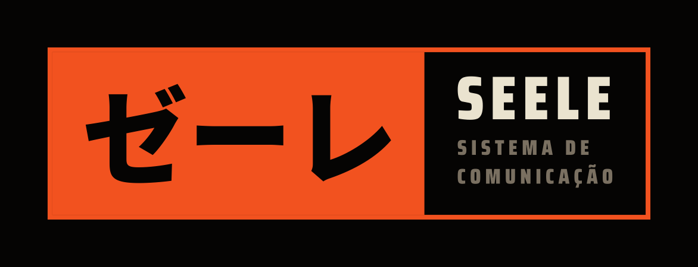

# SEELE

**Voz e texto auto-hospedados. O servidor é seu.**

Você sobe um servidor na sua máquina. Seus amigos conectam nele. Não existe
serviço no meio e não existe cadastro em lugar nenhum: quem hospeda decide quem
entra, e a conversa não passa por ninguém.

Não é um clone de Discord com tema escuro. É a suposição oposta — e a estética
vem daí: densidade de informação e hierarquia de console, não superfície
amigável.

A marca diz o sistema inteiro: **dois nós e uma ligação.** O cheio é quem
hospeda, o vazio é quem chega, a diagonal é o enlace.

---

## Como é por dentro

```text
                        SEELE.app (desktop)
                                 │
                   ┌─────────────┘
                   │  seele-core — sessão, protocolo, áudio, estado
                   │  (nenhuma lógica vive na interface)
                   ▼
             ── QUIC / TLS 1.3 ──
                   ▼
                 seeled
```

Um **servidor** é uma instância: o banco dele, as contas dele, os canais dele.
Dentro dele há **salas de voz** e **canais de texto**. Quem entra é uma
**pessoa**, e a qualidade da conexão de cada uma aparece como **sinal** — um
número de 0 a 100 sempre visível, que é a diferença de caráter em relação a um
cliente de conversa comum.

**A regra mais importante do projeto** é que toda a lógica mora em
`seele-core`, e as interfaces só traduzem evento em pixel e entrada em comando.
Não é convenção: `cargo xtask check-deps` quebra o build se uma casca tentar
enxergar o protocolo direto.

| | |
|---|---|
| Transporte | QUIC (`quinn`), TLS 1.3 obrigatório, uma porta **UDP** |
| Confiança | TOFU — o cliente fixa a chave no primeiro contato, modelo SSH |
| Voz | Opus 48 kHz mono, quadros de 20 ms, DTX, jitter buffer adaptativo |
| Identidade | par de chaves Ed25519, guardado em disco |
| Persistência | SQLite com migrações embutidas, no próprio binário |
| Alcance | rede local, IPv6, porta no roteador por UPnP, e furo de NAT |

---

## A interface

Tauri sobre o mesmo núcleo, e é a única casca do produto — o cliente de terminal
saiu no [ADR 0039](docs/adr/0039-o-produto-passa-a-ter-uma-casca-so.md).

**HOSPEDAR AQUI** sobe um servidor dentro do próprio app e entra nele: quem só
quer clicar nunca precisa abrir um terminal. Ele vive enquanto a janela estiver
aberta, e o link de convite aparece no topo, pronto para copiar. Quem prefere um
servidor que sobrevive à janela instala o `seeled` e o roda como daemon.

O que a tela mostra, e por que:

- **a trilha de servidores**, à esquerda: o histórico de onde você já esteve.
  Apertar um troca de servidor, e a troca pergunta antes — ela derruba a sessão,
  e derruba o servidor junto se for esta máquina que hospeda;
- **as salas e os canais**, ao centro, com quem está em cada sala;
- **a faixa de pessoas**, fixa à direita, agrupada por sala, com o sinal de cada
  uma dentro do cartão;
- **personalização**, para quem administra: nome e ícone do servidor. O ícone é
  PNG, no máximo 8 KiB e 256 px, e o limite está escrito na tela **antes** de
  você escolher o arquivo.

Nenhuma informação é transmitida só por cor. O sinal vem sempre com o número ao
lado, e o mudo tem marcador de texto além da cor — a regra está em
`specs/06-clientes-gui.md` e vale em toda a superfície.

Quando o enlace cai, a interface **não fecha e não mostra um spinner**: ela
esmaece, conta cinco minutos, lista as tentativas de reconexão, e o histórico
continua ali para leitura. Quem entrou num túnel volta para a mesma sala.

> **Capturas:** as que estavam aqui eram retratos do cliente de terminal,
> gerados por um exemplo daquele crate. Saíram com ele. As da interface gráfica
> ainda não existem, e prometer imagem que não há é pior que não ter seção de
> imagem.

## Alcançar de fora

Um servidor em casa está atrás de um roteador, e a internet não o alcança
sozinha. O SEELE sobe uma escada de quatro degraus e põe **todos** os endereços
que encontrar no convite — nunca só o melhor:

| degrau | como |
|---|---|
| 1 | o endereço direto, quando a máquina já tem um IPv4 público |
| 2 | IPv6 nativo, quando as duas pontas o têm |
| 3 | uma porta pedida ao roteador por UPnP |
| 4 | **furo de NAT**, com um ponto de encontro apresentando as duas pontas |

O ponto de encontro não vê nada do que é dito: ele apresenta dois endereços um
ao outro, e guarda em memória, no **quarto**, onde cada anfitrião disse morar —
o servidor e a escuta de avisos, cada endereço valendo 60 segundos desde o
último registro dele —, e quem volta pela lista pergunta ao quarto antes de
tentar. O TLS vai de cada pessoa até o servidor de quem hospeda, e o ponto de
encontro não está nele. Quem hospeda recebe a voz e o texto em claro, como diz
a specs/08. Cada endereço da resposta tem a sua barreira:

- o do **servidor** é conferido pela impressão digital, dentro do TLS, antes de
  qualquer convite ou senha sair;
- o da **escuta de avisos** vira o destino do `LEVE`, que sai **antes** do TLS:
  o ponto repassa a esse destino o IP, a porta e o instante de quem tenta
  chegar. Por isso quem chega só o usa quando ele mora no mesmo IP que o
  servidor da mesma resposta, e a lista de conhecidos nunca guarda o que o
  quarto deu.

**O que sobra, até o `SEELE-ENC/2`** (o registro assinado, no Plano 4): quem
toma as duas marcas do anfitrião no quarto — os nomes, tirados da impressão
digital, sob os quais o servidor e a escuta se registram —, ou só a da escuta
saindo pelo mesmo IP público que ele, recebe pelo `LEVE` o IP, a porta e o
instante de quem tenta chegar. O conteúdo, o convite, a senha e o apelido não
saem: o TLS recusa o servidor errado. `seele-encontro` é o programa, e o
[`docs/ponto-de-encontro.md`](docs/ponto-de-encontro.md) diz o que ele guarda, o
que um ponto hostil consegue e quando as marcas ficam livres.

O degrau 4 foi exercitado entre duas máquinas em redes diferentes — uma em casa
atrás de CGNAT, outra numa rede móvel — e o convite passa a carregar o bilhete
que abre o caminho. O ADR 0022 conta a escada inteira, e por que o degrau 5
(retransmitir pelo servidor) está fora de escopo por decisão.

---

## Instalar

### Um arquivo, tudo dentro

Na aba **Releases**, um instalador por sistema: `.dmg` no macOS (Apple
Silicon) e `.exe` no Windows. Cada um traz as duas coisas — o app gráfico e o
`seeled` —, então quem instala não precisa decidir nada antes de entender a
diferença. Linux e Mac Intel ainda não têm pacote: neles se compila do código,
como está mais abaixo.

**Nada é assinado.** No macOS o sistema vai dizer que *não consegue verificar
se o app contém malware*, e o botão que ele oferece é "Mover para o Lixo". Não
é detecção de nada: é a ausência de notarização, que exige conta paga da Apple.
A saída é uma linha, `xattr -dr com.apple.quarantine /Applications/SEELE.app`,
ou, depois da primeira tentativa de abrir, **Ajustes do Sistema** →
**Privacidade e Segurança** → **Abrir Mesmo Assim** (*Open Anyway*), o caminho
do macOS 15, que tirou o atalho do botão direito. No Windows o SmartScreen
avisa e o caminho é **Mais informações** → **Executar assim mesmo**. As notas
de release explicam cada caso.

### Só o servidor, numa linha

**macOS e Linux:**

```sh
curl -fsSL https://raw.githubusercontent.com/DATA-AND-DEV/SEELE/main/install.sh | sh
```

**Windows**, num PowerShell:

```powershell
irm https://raw.githubusercontent.com/DATA-AND-DEV/SEELE/main/install.ps1 | iex
```

O script confere a soma SHA-256 do que baixou contra o `SHA256SUMS` publicado
no release, e recusa instalar se não bater.

Dito isso: **você está prestes a canalizar um script da internet para dentro do
seu shell**, num produto cujo argumento é não depender de terceiros. Se isso
incomoda — e é razoável que incomode —, baixe e leia antes, ou pegue o pacote
direto na aba Releases e confira a soma à mão. As duas alternativas estão no
cabeçalho do próprio script.

Compilando do código-fonte, que é a opção que não exige confiar em ninguém:

```sh
git clone https://github.com/DATA-AND-DEV/SEELE && cd SEELE
cargo build --release --bin seeled
```

No Windows isso pede o Build Tools do Visual Studio — ver `docs/windows.md`.

Depois de instalar pelo `.dmg`, o `seeled` mora dentro do app. Para tê-lo no
`PATH`:

```sh
sudo ln -sf /Applications/SEELE.app/Contents/MacOS/seeled /usr/local/bin/
```

No Windows ele fica na pasta do programa e ainda não entra no `PATH` — ver
`docs/pendencias.md`.

---

## Começar

Numa máquina:

```sh
seeled 0.0.0.0:8383
```

Ele imprime o link para usar na outra máquina, com a impressão digital do
certificado dentro:

```text
na outra máquina, cole no SEELE:
  seele://192.168.0.7:8383?fp=782cc791…   (na mesma rede)
```

Na outra, abra o SEELE, aperte **CONECTAR** e cole o link que o `seeled`
imprimiu. Lá dentro, aperte `?`.

Duas coisas que economizam meia hora:

- **A porta 8383 é UDP**, porque o transporte é QUIC. É o erro de firewall mais
  comum aqui, porque a regra que se escreve de cabeça é sempre TCP.
- **Fones dos dois lados.** Não há cancelamento de eco, e sem fones haverá
  realimentação.

### Fechar o servidor

Por padrão qualquer um que alcance a porta entra — o certo para rede local, e o
`seeled` avisa em voz alta ao subir assim. Para fechar:

```sh
seeled convite rafa        # link de uso único, vale sete dias
seeled senha "a senha"    # ou um segredo para o grupo todo
```

O convite sai como um link pronto para mandar:

```text
seele://192.168.0.7:8383?fp=782cc791…&convite=2QKPAXPP97W5459H3TPA
```

Ele carrega a impressão digital do certificado, então quem recebe **não precisa
conferi-la por outro canal** — o cliente compara sozinho, dentro do aperto de mão
TLS, antes de o convite, a senha ou o apelido saírem:

- num endereço em que esta máquina ainda não fixou chave nenhuma, **recusa** se
  não bater, e nada é fixado;
- no endereço que a pessoa escolheu (o do link), quando ele é **público** (o
  mesmo em qualquer rede) e esta máquina já fixou uma chave ali, um link que
  discorda avisa que não é daquele servidor e **entra**: a chave fixada ali já
  provou quem é (ADR 0003);
- num endereço de **rede local**, como o `192.168.0.7` do exemplo, ou num
  endereço que a pessoa não escolheu (o que o ponto de encontro devolveu, um
  alternativo do convite), o link que discorda da chave fixada ali é
  **recusado**, dentro do TLS e antes do `Hello`. O `192.168.0.7` de uma casa é
  o de outra, e quem atende ali pode ser outro servidor (o adendo de 2026-09-29
  ao ADR 0003). A frase da recusa diz o remédio: confirmar o link com quem o
  mandou; para um servidor da lista, colar de novo o link dele, ou removê-lo da
  lista.

Do outro lado, a pessoa abre o SEELE, aperta **CONECTAR** e cola o link.

A senha do servidor nunca viaja no link, e isso é decisão registrada: senha vale
para sempre, convite gasto não vale nada.

---


---

## Compartilhar a tela

Numa sala de voz, **COMPARTILHAR** — no rodapé, ou ao lado do palco vazio — abre
a caixa que escolhe o que sai desta máquina e até onde ele sobe:

- **o que mostrar** — uma JANELA ou um MONITOR, cada um com o tamanho ao lado;
- **RESOLUÇÃO**, 540p, 720p ou 1080p, e **QUADROS**, 30 ou 60 por segundo. A
  caixa nasce em 720p a 60, e as duas trocas valem durante a transmissão, sem
  parar e recomeçar;
- **INCLUIR SOM**, marcado por padrão. A frase embaixo dele diz o que esta
  máquina faz com a conversa: o macOS, do 13 em diante, a deixa fora do que é
  capturado; o Windows captura a saída inteira, o SEELE junto, e quem fala se
  ouve de volta — por isso a frase oferece compartilhar uma janela em vez do
  monitor, ou desmarcar o som.

A resolução e os quadros são **teto, e nunca piso**. Quando o caminho não compra
o que foi pedido, a imagem desce sozinha — a resolução segura, o quadro cede —, e
o palco mostra o que está saindo ao lado do que foi pedido.

**O vídeo é H.264.** Quem transmite codifica pelo codificador do sistema —
VideoToolbox no macOS, Media Foundation no Windows
([ADR 0041](docs/adr/0041-o-codec-por-hardware-e-a-excecao-ao-unsafe.md)) — e
cai para o OpenH264, em software, quando ele recusa. O OpenH264 é o **módulo do
Cisco, baixado no primeiro uso**: sem ele a caixa não compartilha, e pede para
baixá-lo antes de qualquer outra escolha, dizendo tamanho e origem. O arquivo é
conferido por SHA-256 e fica nesta máquina nas atualizações seguintes. Ele não
vem no instalador por licença, e não por tamanho: a cobertura de patente do
H.264 acompanha o binário que o Cisco distribui, e pô-lo dentro do nosso `.dmg`
nos faria distribuidor sem ela. Há módulo publicado para o macOS em Apple
Silicon e para o Windows x86-64; o Linux não compartilha tela, por decisão — o
portal do sistema pediria `pipewire`, e o binário deixaria de ser autocontido.
Tudo isso mora em `crates/seele-video`.

**Quem leva a imagem até quem assiste é o servidor**, como já faz com a voz. A
**MALHA**, em CONFIGURAÇÕES, deixa a tela vir de outra pessoa: quem assiste
recebe direto de um par, e o servidor reassume sozinho quando o par falha ou
sai. São dois consentimentos, porque são duas perguntas — emprestar a sua subida
é quanto da sua internet você gasta pelos outros; aceitar ser servido é aceitar
que o seu endereço seja entregue a quem te serve. Sem escolher nada, você não
participa, e a tela vem do servidor.

**Entre duas máquinas Windows a tela não aparece.** É regressão, e está aberta
como pendência 33 em `docs/pendencias.md`: os quatro suspeitos foram eliminados
por medida, e o que sobra exige sessão gráfica para investigar.

### A prova que veio antes do código

O desenho está em
`docs/superpowers/specs/2026-08-22-compartilhamento-de-tela-design.md`, e a
prova em `spikes/tela-no-transporte/`. A pergunta que ela respondeu é a que mais
importa: **quando alguém compartilha a tela e a subida da casa não dá conta, o
que sobra da voz?** Um par QUIC inteiro num processo, com um cano de 2000 kbps
no meio, carga com forma de vídeo e sem codec:

```text
cenário                        perda   p50 ms   p95 ms   vídeo kbps
voz sozinha                    0.00%     21.7     22.9            0
vídeo em fluxo, sem teto       0.10%    225.7    258.3         2030
vídeo em datagrama             16.10%   2161.4   2203.1         1981
teto em 60% do caminho         0.00%     23.1     78.9         1280
  + quadro-chave espalhado     0.00%     22.2     35.8         1200
```

Três conclusões, e nenhuma delas era óbvia antes de medir:

- **datagrama é o pior desenho.** Voz e vídeo caem na mesma fila e a voz perde
  de 16% a 98% dos quadros. É o caminho que parecia natural, porque a voz já vai
  por lá;
- **uma segunda conexão não ajuda** — 221 ms de p50, igual a não fazer nada;
- **o que protege a voz não é o transporte, é o teto de bitrate.** Com o vídeo
  limitado a 60% do caminho medido, a voz volta a 23 ms — praticamente o que ela
  custa sozinha.

A regra de aceite da v1 é uma frase: **a voz nunca cede à tela.** Quem baixa
resolução e quem para é o vídeo.

O que ficava de fora da primeira versão está enumerado com motivo na spec —
doze itens, entre eles câmera, gravação e controle remoto. Três entraram
depois: os 60 quadros, por medida
([ADR 0040](docs/adr/0040-sessenta-quadros-entram-por-medida.md)), o codificador
do sistema (ADR 0041) e o som da tela.

---

## Em que pé está

**2.621 testes automáticos passando.** O que eles cobrem:

- dois clientes conversando por texto e voz sintética através do servidor
- pipeline de áudio sob 5% de perda induzida, e soak de dez minutos em tempo
  simulado
- reinício do servidor sem expulsar quem já estava conectado
- senha e convite fechando a porta; convite servindo a uma pessoa só
- limitação de taxa nas duas pontas: quem bate à porta em laço é recusado com
  motivo, e quem inunda de mensagens é avisado antes de ser derrubado
- a interface: que a ajuda não prometa uma tecla que não existe, que o
  vocabulário aposentado não volte à tela, que a marca não use o vermelho de
  alerta, e que os retratos acima saiam do código que desenha

Verificado **entre duas máquinas de verdade**, em redes diferentes: o furo de
NAT abrindo caminho de uma casa atrás de CGNAT para uma rede móvel, com o ponto
de encontro apresentando as duas pontas.

Ainda **não** verificado: voz por microfone real entre duas máquinas, com as
duas pessoas se ouvindo. É a última validação que falta, e
`docs/teste-duas-maquinas.md` é o roteiro dela.

O que está frouxo está em `docs/pendencias.md`, com nome e motivo.

---

## O repositório

| onde | o quê |
|---|---|
| `specs/` | a fonte de verdade, escrita antes do código |
| `crates/seele-proto` | tipos do protocolo, serialização, versionamento |
| `crates/seele-audio` | codec, jitter buffer, mixer, deriva de clock, simulador de rede |
| `crates/seele-core` | o núcleo: sessão, estado, voz. Tudo que pensa |
| `crates/seele-server` | `seeled`, o servidor |
| `crates/seele-encontro` | o ponto de encontro do furo de NAT |
| `crates/seele-ffi` | a superfície que as cascas gráficas falam |
| `apps/seele-app` | o cliente desktop, Tauri |
| `design/marca/` | a marca, e o gerador de todos os tamanhos dela |
| `docs/adr/` | por que cada decisão difícil foi tomada assim |
| `docs/pendencias.md` | o que está quebrado e ainda não foi consertado |
| `spikes/` | provas de conceito, com a pergunta e o número que a respondeu |

As ADRs são o melhor lugar para entender o projeto de verdade: cada uma diz o
que foi decidido, o que foi descartado, e o que custa voltar atrás. O código as
cita quase seiscentas vezes, e não por formalidade — quando um comentário
explica por que uma linha é daquele jeito, a razão inteira está numa delas.

---

## Licença

Ainda não definida, mas o que a segurava saiu do caminho.

A interface carregava vocabulário e citações vindos de uma obra de terceiro, e
definir direitos com isso dentro era o tipo de decisão que se toma errado. Uma
avaliação de usabilidade mostrou que aquele vocabulário também cobrava um preço
de quem chegava, e as duas razões apontaram para o mesmo lugar: os nomes
passaram a ser o que as coisas são, e a marca passou a ser dois nós e uma
ligação. O que saiu, de onde, e por quê está nos ADRs
[0033](docs/adr/0033-o-vocabulario-sai-da-interface-a-estetica-fica.md),
[0034](docs/adr/0034-a-marca-abandona-as-duas-citacoes-do-anime.md) e
[0035](docs/adr/0035-o-codigo-deixa-de-falar-evangelion.md).

Fica a estética inteira, que nunca foi o problema: mono, laranja sobre
quase-preto, canto reto, sem sombra.
