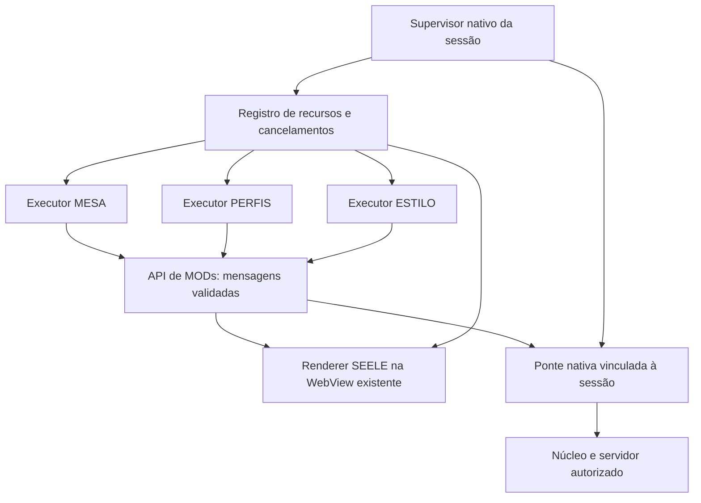

# Implementação proposta para Claude: MODs por sessão com API própria

**Estado: especificação para implementação, ainda não implementada.** Base: checkout `23fc654` e discussão com o responsável. Esta é a direção recomendada após ele aceitar uma API própria para priorizar leveza. Não altera, por si só, o status dos ADRs ou a versão pública da API.

**Claude: começar por este arquivo e executar os anexos na ordem.** O [roteiro de execução](mods-api-propria/roteiro-de-execucao.md) mapeia funções reais, repositórios, etapas, dependências e provas. O [contrato de API e fluxos](mods-api-propria/contratos-e-fluxos.md) define as operações propostas, mensagens, eventos, recursos e tratamento de corridas. Adaptar a organização ao código encontrado; não reduzir os requisitos para fazer uma etapa passar. O andamento está no [registro de execução](mods-api-propria/registro-de-execucao.md).

**Atualização após a sonda de `1900b37`:** seguir a [diretriz após E1](mods-api-propria/diretriz-apos-sonda-e1.md). O Worker de Blob atual não satisfaz o contrato. QuickJS nativo é o próximo candidato a validar; E2 pode avançar na parte independente do executor, sem declarar o isolamento concluído.

## 1. A decisão

**Reaproveitar a WebView do SEELE para apresentar as interfaces, executar a lógica de cada MOD fora do contexto da janela e fazer a sessão ser proprietária de todos os seus efeitos.**

O motor existente é WKWebView/WebKit no macOS, WebKitGTK no Linux e WebView2 no Windows, conforme a [documentação do Tauri](https://v2.tauri.app/reference/webview-versions/). Não adicionar um motor de navegador ao instalador nem exigir uma WebView por MOD, cartão, pessoa ou painel.

O caminho inicial investigado foi **um Worker por instância de MOD**, ampliando a arquitetura do ADR 0049. A sonda encontrou armazenamento persistente na origem do produto: esse Worker não passa a etapa 1. A orientação agora é prototipar **QuickJS nativo no cliente**, fora da thread da interface, com bindings restritos e descarte por instância. O renderer e a API visual continuam os mesmos. A adoção definitiva depende das provas de isolamento, encerramento e desempenho; não implementar e manter dois executores públicos por precaução.

Isso amplia a apresentação da API 3 sem voltar ao JavaScript de terceiros dentro da janela. O MOD controla a experiência de seu servidor por primitivas amplas. O SEELE controla a execução, a criação dos recursos e sua destruição. Bibliotecas JavaScript que dependem de DOM, Node ou APIs não oferecidas precisarão de adaptação; não prometer compatibilidade irrestrita com bibliotecas web.

## 2. As peças e suas responsabilidades

- **Executor do MOD:** roda somente a lógica do autor, fora da thread JavaScript da interface. Uma instância corresponde a uma sessão e a um MOD; vários cartões não criam novos executores.
- **API e receptor:** recebem operações tipadas e limitadas, conferem a instância antes de executar qualquer efeito e retornam resultados/eventos. O receptor não confia que o autor usará o SDK corretamente.
- **Renderer confiável:** cria elementos, aplica estilos locais, executa desenho e apresenta mídia. Somente código do SEELE roda aqui. Código recebido como string, handlers de terceiros e atributos executáveis não são aceitos.
- **Ponte nativa e núcleo:** mantêm a autoridade sobre conexão, arquivos e recursos nativos. Preservar as fronteiras de dependência do projeto; a interface não passa a conter lógica de protocolo.
- **Supervisor e registro de recursos:** controlam o estado da sessão, revogam autoridade, cancelam operações e exigem descarte, mesmo quando o MOD não coopera.

## 3. Identidade da instância e fronteira de autoridade

O anfitrião atribui a identidade de servidor, a sessão, sua geração, o MOD, o hash do pacote e um identificador de instância. Endereço IP e ID textual do MOD, sozinhos, não identificam uma execução. Entrar de novo no mesmo servidor cria uma geração nova.

A ponte conhece a instância pelo canal que ela criou, e não por um campo que o MOD pode falsificar. Toda operação captura a conexão de origem: nunca resolver uma operação antiga contra a conexão global que estiver ativa depois de um `await`.

A validação precisa ocorrer **antes de efeitos**, ao admitir trabalho e novamente ao concluir uma operação assíncrona. Arquivo lido, imagem decodificada ou upload concluído depois da saída é descartado localmente, sem montar nada na sessão seguinte. Uma resposta tardia não pode tocar em outro MOD nem em outra sessão.

O servidor continua aplicando permissões de pessoa e canal. Dados dos MODs pertencem ao servidor e ao MOD; exportações e integrações precisam de operações explícitas. Consultas devem entregar apenas os dados autorizados. Um MOD não ganha acesso a chaves de identidade, preferências globais, disco arbitrário, comandos gerais do Tauri ou dados de outros servidores.

### 3.1 Worker não é uma caixa de areia completa por seu nome

O Worker atual é criado de um Blob com a origem da aplicação. Não ter `document`, `window` ou o objeto global do Tauri não prova isolamento de armazenamento, rede, IPC ou canais entre contextos.

**A primeira etapa deve demonstrar a fronteira real:** origem/CSP do executor, armazenamento, APIs de comunicação, criação de descendentes e acesso à ponte. Não aceitar como barreira apenas `Object.freeze`, apagar funções globais ou pedir que o autor use somente o SDK. O código de teste deve tentar acessar diretamente os caminhos alternativos.

Comandos nativos precisam validar a autoridade do chamador; a [documentação de capabilities do Tauri](https://v2.tauri.app/security/capabilities/) distingue permissões de plugins e comandos próprios, além de registrar limitações com iframes. Uma página auxiliar de bootstrap, se necessária, não pode herdar o IPC privilegiado da janela.

Se o protótipo não conseguir oferecer somente a autoridade de sessão com o Worker nos sistemas suportados, registrar a falha e experimentar o executor QuickJS com bindings restritos. Não declarar a garantia cumprida e deixar o acesso ambiental como dívida posterior. Essa troca de executor não exige uma WebView por MOD.

## 4. A API visual é de composição, não de produtos prontos

Oferecer primitivas que possam ser combinadas para construir experiências novas:

| Família | Contrato necessário |
| --- | --- |
| Layout | Contêineres, grid, fluxo, camadas, rolagem, alinhamento, dimensões, transformações e clipping |
| Interação | Campos, seleção, foco, teclado, ponteiro, captura e arraste; texto e estados acessíveis |
| Aparência | Tipografia, fontes do pacote, cores, bordas, fundos, imagens, espaçamento, efeitos e animações |
| Desenho | Caminhos, formas, texto, sprites e canvas 2D com comandos agrupados; recursos gráficos reutilizáveis |
| Mídia | Imagens, áudio e vídeo, reprodução/pausa e liberação; sem transferir o controle global da chamada ao MOD |
| Arquivos | Seleção pelo usuário, recursos do pacote, uploads/downloads autorizados e cancelamento; devolver handles, não caminhos livres |
| Integração | Superfícies de pessoas, canais, área principal, diálogos e composição da experiência da sessão |
| Dados e eventos | Pedidos ao servidor, consultas filtradas e assinaturas vinculadas à sessão, evitando polling desnecessário |

Um mapa ou editor novo deve poder ser criado com essas primitivas, sem acrescentar uma forma específica para cada produto. Componentes prontos são conveniência do SDK. Desenho 3D/acelerado requer extensão própria e validação de plataforma; não fingir que canvas 2D fornece todas as possibilidades de WebGL/WebGPU.

### 4.1 Protocolo de apresentação

Definir operações de criar superfície/nó, atualizar propriedades, inserir/remover filhos, aplicar comandos de desenho e destruir recursos. IDs pertencem à instância; não são seletores livres do DOM. Uma superfície pode ocupar a experiência inteira do servidor, mas não esconder ou substituir o controle confiável de saída e recuperação do produto.

Usar IDs estáveis e alterações incrementais. Digitar em uma ficha não remonta a árvore nem perde foco, seleção ou composição de texto. Eventos do renderer voltam como dados para o executor; as funções do MOD continuam lá. Interações nativas como digitação, rolagem e feedback imediato de arraste não devem depender de ida e volta ao servidor a cada movimento; mudanças de domínio são confirmadas pelo servidor.

Estilos são propriedades validadas e confinadas à superfície. URLs, fontes e mídia usam recursos autorizados. Não aceitar CSS global ou HTML arbitrário como atalho para executar código ou alcançar a janela. Shadow DOM pode ajudar a encapsular estilos, mas não é a fronteira de execução ou de autoridade.

O servidor define a composição e a prioridade de MODs que disputam uma superfície ou camada de tema. O resultado não depende de quem enviou a última mensagem. ESTILO pode transformar amplamente a sessão; launcher, conexão, configurações pessoais e outras sessões preservam a identidade do usuário.

### 4.2 Recursos visuais também têm proprietário

Ao criar áudio, uma URL de Blob, fonte, imagem, timer do anfitrião ou textura, o próprio binding registra o dono. Não exigir um `registrarParaLimpar` manual do autor. O renderer mantém os objetos de navegador e seus descartadores; o supervisor nativo mantém a autoridade e os recursos nativos, sem fingir que Rust controla diretamente cada objeto do DOM.

Um handle compartilhado pode reaproveitar bytes ou uma imagem decodificada por referência, mas cada uso continua com dono e autorização. Fechar o editor de ESTILO libera sua interface sem necessariamente remover o tema ativo da sessão. Sair da sessão remove ambos.

Persistência local deve ter namespace e política explícitos. O cache de pacotes pode permanecer no disco sem manter execução. Service Workers, SharedWorkers, popups e trabalhos independentes não podem criar uma vida útil fora da sessão; proibir a criação não supervisionada ou oferecer equivalentes pertencentes ao mesmo grupo de descarte.

## 5. Saída obrigatória e idempotente

Estados mínimos: `criando`, `ativa`, `encerrando`, `encerrada`. O supervisor pode encerrar uma instância em qualquer estado. A revogação é monotônica: a instância encerrada nunca volta a ficar ativa.

1. **Revogar a geração:** a partir desse ponto, nenhum novo efeito daquela instância é admitido, mesmo que mensagens já estejam na fila.
2. **Cancelar operações:** rede, assinaturas, carregamentos, decodificação e tarefas do anfitrião; rejeitar resultados tardios.
3. **Encerrar os executores:** interromper e descartar os runtimes e trabalhos supervisionados, sem aguardar callback do autor; confirmar o encerramento pelo mecanismo próprio do executor.
4. **Parar e descartar recursos:** áudio/vídeo, buffers, texturas, fontes, URLs, listeners e timers gerenciados, inclusive recursos de interfaces já fechadas.
5. **Remover superfícies e camadas de tema:** revelar as preferências pessoais existentes, sem gravar uma cor fixa por cima delas.
6. **Conferir o registro:** nenhum recurso ativo pertencente à geração encerrada; liberar referências. Uma segunda chamada de encerramento é segura.

Saída local, expulsão, encerramento remoto, troca de servidor, alteração do conjunto de MODs e falha definitiva de conexão passam pelo mesmo encerramento. Não depender só do evento remoto `Ended`: o checkout já documenta que a saída local não o emite. Se a conexão for perdida temporariamente, suspender operações dependentes dela imediatamente; ao reativar os MODs, usar nova geração e descartar respostas da conexão anterior. Não repetir automaticamente gravações sem contrato de idempotência.

Desconectar um participante não apaga campanhas, perfis ou temas persistidos no servidor e não encerra os MODs dos demais participantes. A exceção já existente é “Hospedar aqui”: quando o usuário encerra o servidor hospedado no próprio app, seu ciclo de vida derruba os outros clientes por decisão do produto.

`terminate()` encerra o contexto do Worker segundo a [especificação HTML](https://html.spec.whatwg.org/multipage/workers.html#terminate-a-worker); não é um descarte automático de objetos que outro contexto ou o lado nativo criou em resposta a ele. Eventos de encerramento para o autor podem existir como conveniência, nunca como condição para limpar.

### 5.1 O renderer não pode ser um caminho para travar a saída

Validar no receptor quantidade e tamanho de mensagens, largura e profundidade das árvores, recursos e trabalho por lote. Limitar filas e suspender instâncias que excedam o orçamento. A validação é aplicada mesmo quando o MOD contorna o SDK e envia mensagens diretamente. Um limite apenas no prelúdio do Worker não contém esse caso.

Usar execução visual em lotes curtos e orçamento por quadro. Uma animação declarada não deve exigir uma mensagem por quadro. Imagens e buffers grandes não devem trafegar repetidamente como JSON. Avaliar canvas transferível só nas plataformas que o suportam; a API deve ter um caminho compatível documentado.

O encerramento nativo da sessão precisa funcionar mesmo se o JavaScript de interface não responder. Demonstrar um caminho de saída/recuperação fora do renderer; o botão HTML da própria janela não é prova suficiente. Se for necessário recriar a WebView existente como recuperação, fazê-lo com supervisão nativa e verificar que o ambiente antigo realmente terminou. Não publicar uma promessa de encerramento forçado baseada apenas numa chamada assíncrona de fechar.

A garantia cobre a execução e os recursos oferecidos pelo contrato, incluindo MODs que não cooperam. Não prometer proteção absoluta contra falhas do sistema operacional, bugs do motor ou consumo ilimitado. Se a implementação compartilhada não passar nos testes de responsividade e descarte, a fronteira deve ser revista antes de publicar.

## 6. Ordem de trabalho para Claude

1. **Fechar a fronteira do executor e da ponte.** Demonstrar os acessos ambientais reais, instância imutável, revogação antes dos efeitos e rejeição de mensagens antigas. Após a sonda de `1900b37`, prototipar QuickJS nativo conforme a diretriz após E1. Produzir o resultado do experimento antes de desenvolver uma biblioteca visual grande.
2. **Implementar o ciclo de vida e o registro de recursos.** Cobrir todos os caminhos de saída e as corridas de montagem, mídia e troca de sessão. Criar contadores de diagnóstico por instância e geração, acessíveis na bancada.
3. **Entregar uma fatia vertical interativa.** Formulário que salva no servidor, arraste, desenho livre, imagem, áudio gerenciado e tema da sessão. Deve funcionar no app real e limpar ao sair, inclusive com um MOD em loop e outro inundando mensagens.
4. **Ampliar as primitivas e integrar os três MODs.** Recuperar comportamentos reais a partir dos clientes anteriores; telas somente de leitura não contam como migração completa. Manter dados, permissões e contratos de servidor sempre que possível. Incluir uma experiência nova criada com as mesmas primitivas para detectar uma API feita apenas para três exemplos.
5. **Medir e fechar versão/documentação.** Comparar a fatia e os MODs completos com a referência atual no mesmo sistema, máquina, carga e métrica; publicar capacidades, erros e limites junto com implementação, guia do site e indexador. Não usar no catálogo métodos propostos que o runtime ainda não implementa.

Pontos concretos do checkout: `montarOMod`, `atenderOMod`, `montarODeclarado`, `limparARegiaoDoMod` e `encerrarOAmbienteDosMods` em [base.js](../apps/seele-app/ui/base.js); saída local em [tela-sessao.js](../apps/seele-app/ui/tela-sessao.js); `Session`, `mod_request` e desmontagem em [main.rs](../apps/seele-app/src/main.rs). Há uma divergência entre comentário API 3 e constante `MOD_API_VERSION = 2` em [seele-proto](../crates/seele-proto/src/mods.rs), que precisa ser reconciliada na entrega. Não escolher uma numeração nova sem conferir protocolo, parser, pacotes e indexador.

## 7. Critérios de aceite

| Teste | Resultado necessário |
| --- | --- |
| Aplicar tema, abrir os três MODs e sair localmente | Tela inicial e preferências pessoais restauradas; nenhum recurso ativo da geração antiga |
| Sair durante montagem, upload, decodificação ou resposta | Nenhuma montagem ou efeito tardio, inclusive ao reentrar no mesmo servidor |
| Trocar A → B com o mesmo ID de MOD instalado | Dados, tema, eventos e mídia de A não alcançam B |
| Expulsão, término remoto, reconexão e mudança de conjunto | Caminho de revogação consistente, sem reutilizar instância anterior |
| Loop infinito, Worker descendente e envio direto de mensagens | Saída responsiva; nenhuma execução descendente fora do grupo permitido |
| Tentativa direta de IPC, armazenamento e comunicação fora da API | Autoridade fora da sessão recusada pela fronteira real, sem depender de boa conduta do SDK |
| Áudio tocando/agendado, vídeo, fontes e imagens ao sair | Reprodução interrompida e recursos descartados; trabalho atrasado não os recria |
| Árvore enorme e carga visual excessiva | Receptor contém trabalho; controle confiável de saída/recuperação permanece utilizável |
| Dois usuários no servidor; um sai | Estado persistido e experiência do outro permanecem corretos |
| Dezenas de ciclos entrar/sair, após aquecimento | Contadores de recursos retornam ao estado esperado; investigar crescimento persistente em vez de confundir todo cache com vazamento |
| MESA, PERFIS e ESTILO completos, com voz ativa | Interação e mídia funcionam sem regressão relevante na voz, memória e responsividade |

Executar no Windows e macOS, e validar Linux para a matriz suportada. Não substituir a WebView nativa por testes exclusivamente em Chromium de desenvolvimento. Os testes de concorrência devem criar deliberadamente respostas atrasadas e tentativas de falsificar instâncias.

## 8. Referência de desempenho e entrega esperada

O responsável observou aproximadamente **10 MB no SEELE e 90 MB em um processo associado**, no Windows. Tratar isso como referência relatada de cerca de 100 MB na métrica exibida, ainda sem uma coleta completa que confira todos os processos e a carga. Reproduzir a referência antes de prometer um teto absoluto para a nova implementação.

O [teste no Mac](medicao-mods-desktop-2026-09-18.md) registrou medianas de 228,57 MiB sem MODs e 239,78 MiB com os três após reiniciar; tabuleiro simples aberto, em outra rodada, 287,13 MiB. Também reproduziu o tema persistindo após a saída na API 2 instalada. As métricas e plataformas não são intercambiáveis.

Entregar uma implementação verificável, contrato documentado, MOD de teste interativo, matriz de capacidades recuperadas dos três MODs e relatório de memória/CPU/latência/descarte. O requisito de leveza é evitar custo fixo desnecessário e regressão material na carga equivalente; não inventar um orçamento em MB sem medir.

**Instrução resumida para Claude:** implementar MODs com lógica isolada por instância de sessão, API própria de composição/interação/desenho/mídia, renderer compartilhado na WebView atual e supervisor nativo com revogação e descarte obrigatório. Após a reprovação do Worker atual, validar QuickJS nativo e avançar no ciclo de vida conforme a diretriz após E1; depois recuperar liberdade visual e os três MODs completos. O dono dos efeitos é a sessão, a limpeza é do SEELE e os dados persistentes continuam pertencendo ao servidor.
