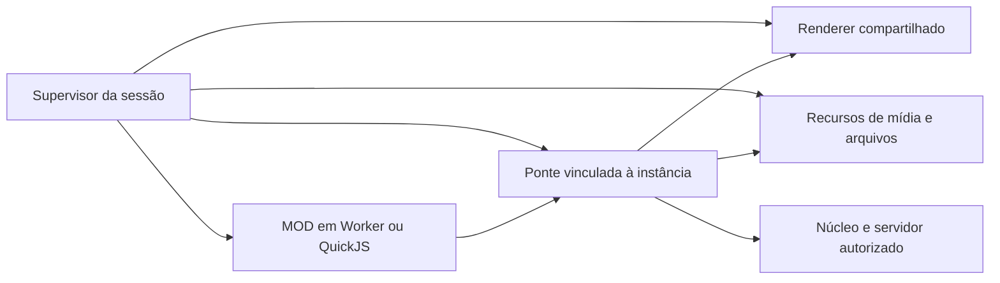

# Opções para MODs livres, leves e restritos à sessão

**Estado: análise e recomendação; nenhuma mudança de runtime implementada.**
Base consultada: checkout `23fc654`, em 18/09/2026. Preferência confirmada pelo responsável: **aceita API própria, priorizando leveza**. Esta análise atualiza a recomendação da [proposta anterior](proposta-api-mods-liberdade-com-limpeza-por-servidor.md); uma aplicação web completa por MOD deixa de ser o caminho principal.

**Roteiro para implementação:** o [contrato destinado ao Claude](contrato-mods-api-propria-para-claude.md) transforma esta comparação em etapas ligadas ao código. Parte do Worker existente, exige provar sua fronteira de autoridade e mantém QuickJS como alternativa se essa prova falhar. A apresentação continua na WebView atual. Esta página permanece como análise das opções e das medições, sem substituir o roteiro operacional.

## 1. O que o SEELE está tentando ser

O [README](../README.md) descreve voz e texto auto-hospedados, com dados e autoridade pertencendo ao servidor. A interface Tauri traduz eventos e comandos de um núcleo separado. O [ADR 0045](adr/0045-mods-o-produto-base-tem-regras-e-um-mod-nao.md) pretendia permitir que os MODs transformassem a experiência do servidor. O [ADR 0049](adr/0049-um-mod-deixa-de-rodar-na-janela-do-produto.md) retirou o JavaScript de terceiros da janela para tornar possível encerrar sua execução.

Os requisitos atuais são compatíveis: liberdade de criar experiências, baixo custo fixo e fim obrigatório dos efeitos locais ao sair. O conflito surge se “liberdade” exigir executar código no contexto privilegiado da janela ou consumir recursos ilimitados. O responsável confirmou que compatibilidade direta com HTML/CSS e bibliotecas de navegador não é obrigatória.

**Recomendação: API própria de composição, interação, desenho e mídia, com execução isolada e renderização compartilhada.** Comparar Worker e QuickJS para executar a mesma API. Não escolher um novo navegador por MOD como infraestrutura padrão.

## 2. O que existe no código

| Evidência | Consequência para a decisão |
| --- | --- |
| [Configuração Tauri](../apps/seele-app/tauri.conf.json): uma janela principal e interface local | Já existe um motor de apresentação; é possível reaproveitá-lo |
| [Cliente de MODs](../apps/seele-app/ui/base.js), `montarOMod`: um Worker por MOD, criado a partir de Blob | A lógica já está fora do JavaScript da janela; não é preciso voltar ao modelo antigo para oferecer interação |
| `montarODeclarado`: cinco formas, somente texto, com substituição da região | A perda funcional vem também da gramática e do renderer estreitos; não é uma consequência necessária de usar Worker |
| `SeeleUI.tema`: quatro cores na sessão | ESTILO precisa de composição e tema mais amplos, sem alterar preferências globais |
| `encerrarOAmbienteDosMods`: termina Workers, remove regiões e rejeita pedidos pendentes | É uma base de descarte; recursos de mídia e tarefas nativas futuros precisarão de propriedade explícita |
| [Runtime do servidor](../crates/seele-server/src/mods/mod.rs): QuickJS por MOD, limite de heap e interrupção | Há experiência e infraestrutura reutilizáveis; o cliente ainda não usa esse runtime para seus MODs |
| [Ponte nativa](../apps/seele-app/src/main.rs), `mod_request`: consulta a conexão da `Session` | A nova ponte deve vincular cada operação à instância de sessão de origem, inclusive após esperas assíncronas |

Há cuidados que a ampliação não pode herdar sem revisão. A checagem de Worker atual em `atenderOMod` protege a resposta, mas não antecede todos os efeitos. `montarOMod` verifica a presença do ID após carregar o código, sem identificar a geração da sessão. O limite de oito pedidos no prelúdio não contém um autor que envie mensagens diretamente. O limite de profundidade da árvore não limita sua largura. São observações do código, não relatos de exploração reproduzida nesta análise.

O Worker de Blob tem a origem da aplicação. Ausência de `document` e do objeto global do Tauri não demonstra ausência de armazenamento, rede ou outros canais disponíveis no ambiente. A auditoria deve verificar a superfície real, a CSP e a ponte nativa; esconder funções no JavaScript não é uma barreira de autoridade. A [especificação de Workers](https://html.spec.whatwg.org/multipage/workers.html) distingue o ambiente de execução e seu encerramento; ela não atribui automaticamente a um Worker os recursos criados pelo anfitrião.

Uma inconsistência separada foi encontrada em [seele-proto/src/mods.rs](../crates/seele-proto/src/mods.rs): o comentário descreve API 3, mas `MOD_API_VERSION` vale `2` nesse checkout. Isso precisa ser reconciliado antes da distribuição. Não altera a comparação de arquiteturas e não informa qual versão está instalada nos computadores dos usuários.

## 3. As opções

Os custos abaixo são hipóteses estruturais, não medições de RAM dos candidatos.

| Opção | Liberdade oferecida | Custo e dificuldade | Avaliação |
| --- | --- | --- | --- |
| **A. Worker + API visual ampla** | Layouts, eventos, formas, canvas, mídia e composição por API | Reaproveita o cliente atual e a WebView. Há custo de contexto, mensagens, árvores e recursos visuais | **Primeiro protótipo: menor mudança** |
| **B. QuickJS no cliente + a mesma API visual** | A mesma liberdade da A, com JavaScript e bibliotecas compatíveis com o ambiente oferecido | Runtime pequeno como candidato; exige scheduler, bindings e ponte Rust/UI. Sem APIs de navegador automáticas | **Comparar com A: candidato forte para controle de memória e autoridade** |
| **C. Iframes isolados na WebView existente** | Documento web próprio e ampla compatibilidade | Documentos adicionais; processos dependem do motor. Iframe não garante saída responsiva durante um travamento | Não é o padrão recomendado para a garantia exigida |
| **D. Ambiente web descartável por sessão de servidor** | Experiência web ampla, com vários MODs compostos na sessão | Pode amortizar a infraestrutura; exige separar a tela de sessão da janela atual. Falhas podem atingir toda a sessão | Alternativa se documentos web completos se tornarem indispensáveis |
| **E. Ambiente web separado por MOD** | Maior compatibilidade com aplicações web existentes | Pode multiplicar documentos, renderers e serviços; integração de cartões e superfícies é mais difícil | Candidato da proposta anterior; não priorizar com o requisito de leveza |

Na D, juntar MODs no mesmo contexto JavaScript não os isola uns dos outros. É possível compartilhar apresentação e serviços mantendo contextos distintos; o mecanismo exato precisa ser provado. Na E, criar WebViews não demonstra processos independentes nem encerramento forçado individual. O [modelo de processos do WebView2](https://learn.microsoft.com/en-us/microsoft-edge/webview2/concepts/process-model) permite compartilhamento de serviços e renderers, e múltiplas pastas de dados podem criar grupos adicionais de processos. Esses detalhes exigem validação nos três sistemas.

WASM é outra escolha de execução ou de módulo de cálculo; não fornece sozinho layout, texto, mídia ou descarte. Trocar JavaScript por WASM não resolve a superfície visual nem comprova menor consumo. Voltar a scripts na janela e depender de `unload` também não atende ao requisito.

## 4. Como uma API própria evita limitar a criatividade

O erro a evitar é acrescentar apenas uma lista de componentes específicos: ficha, dado, campanha, perfil. A API deve oferecer **primitivas combináveis**, e os autores constroem essas ferramentas sobre elas.

| Grupo | Capacidades propostas | Exemplos de uso |
| --- | --- | --- |
| Composição | Contêineres, fluxo, grid, camadas, rolagem, posicionamento, clipping, transformações, dimensões | Painéis, interfaces inteiras de sessão, HUDs, editores |
| Interação | Texto editável, seleção, foco, teclado, ponteiro, captura e arraste, acessibilidade | Fichas, atalhos locais, peças de tabuleiro, ferramentas colaborativas |
| Aparência | Cores, tipografia, fontes do pacote, bordas, fundos, imagens, animações e tema da sessão | ESTILO completo e identidades visuais diferentes |
| Desenho | Caminhos, formas, texto, sprites e canvas 2D; buffers de comandos e recursos reutilizáveis | Mapas, gráficos, jogos e editores não previstos pelo SEELE |
| Mídia e arquivos | Imagens, áudio/vídeo, controles de reprodução, seleção de arquivos pelo usuário, uploads e recursos do servidor | Retratos, banners, trilha da MESA, ferramentas de criação |
| Superfícies | Área principal, pessoas, canais, painéis, diálogos e composição da sessão inteira | MODs integrados ao servidor, sem depender dos seletores privados do produto |
| Domínio | Eventos e consultas autorizados, pedidos ao servidor, dados persistidos por servidor/MOD | Colaboração entre os participantes e regras próprias |

Desenho acelerado/3D é uma extensão importante a avaliar com o mesmo modelo de propriedade. Não prometer toda a API WebGL/WebGPU no primeiro contrato nem fingir que canvas 2D cobre qualquer aplicação 3D. A implementação deve demonstrar uma saída extensível para experiências além dos três MODs oficiais.

Essa direção é próxima de um DOM remoto: o MOD mantém uma representação da interface e envia alterações; o SEELE mantém os elementos reais. O [Remote DOM da Shopify](https://github.com/Shopify/remote-dom) demonstra o padrão, inclusive execução sem DOM com um polyfill mínimo e integração com frameworks. Serve de referência técnica, não de recomendação automática de dependência. Não é um navegador completo e não torna qualquer biblioteca web compatível.

O SDK pode oferecer uma sintaxe familiar e adaptadores de bibliotecas. Consultas de layout, eventos síncronos e acesso direto ao documento exigirão adaptação ou não serão suportados. Essa é a troca aceita pela preferência por API própria: liberdade para compor experiências, sem prometer compatibilidade irrestrita com software de navegador.

### 4.1 O renderer também precisa ser leve

- Identidades estáveis e alterações incrementais; editar uma ficha não deve reconstruir sua árvore inteira e perder foco ou seleção.
- Atualizações agrupadas; mover uma peça não deve serializar todo o mapa a cada movimento do ponteiro.
- Imagens, sons e fontes enviados/carregados uma vez e referenciados por identificadores. Evitar cópias e codificações grandes em JSON.
- Animações simples executadas pelo renderer a partir de parâmetros, sem uma mensagem do MOD por quadro.
- Um caminho de canvas com comandos em lote; medir o custo de cópia antes de escolher desenho no anfitrião ou transferência de canvas para Worker.
- Listas proporcionais ao conteúdo visível; cem participantes não exigem cem runtimes.
- Recursos pesados criados sob demanda. Fechar o editor de ESTILO deve poder liberar sua interface sem remover o tema da sessão.

Canvas em Worker, codecs e aceleração dependem das versões dos motores suportados. A configuração atual admite macOS 11; suporte no navegador de desenvolvimento não basta. A API deve declarar capacidades e alternativas de execução.

Não é necessário criar uma segunda árvore gigante de objetos por conveniência. Os dois lados precisam guardar apenas o estado necessário à execução e à apresentação, com liberação explícita de referências.

## 5. Worker ou QuickJS?

**Worker é o caminho mais curto para recuperar os MODs.** Mantém a organização atual, aproveita o motor JavaScript do navegador e permite comparar a nova apresentação com poucas mudanças no runtime. Seus desafios são a superfície ambiental real, as filas de mensagens e a falta de um teto de heap por MOD equivalente ao controle já usado no QuickJS.

**QuickJS merece um protótipo antes de congelar o runtime definitivo.** Permite oferecer somente os bindings de sessão e controlar o heap do interpretador. O projeto já utiliza interrupção de execução e limite de memória no servidor. A [documentação do QuickJS](https://bellard.org/quickjs/quickjs.html) descreve esses controles. Não confundir o interpretador embutido com expor módulos de sistema, disco ou processos ao MOD.

Na opção B, o código roda fora da thread da interface e das tarefas críticas de voz. Um runtime por MOD permite orçamentos independentes. O anfitrião precisa interromper loops, controlar a fila de jobs e manter bindings nativos curtos e canceláveis; uma interrupção de bytecode não interrompe uma função nativa arbitrária bloqueada. Não há garantia de contenção de falhas nativas equivalente à de processos separados.

O limite de heap do QuickJS não inclui automaticamente texturas, buffers externos, filas e mídia. Todos entram na contabilidade da sessão. O cliente também precisará de temporizadores, módulos e assincronismo próprios. Bibliotecas de cálculo JavaScript podem ser candidatas; bibliotecas que pressupõem navegador ou Node exigem análise e adaptação.

A lógica comum pode ser extraída para um módulo/crate apropriado, preservando as fronteiras `core`/`ffi`/interface. Reutilizar a ideia não significa importar o anfitrião de servidor com permissões de disco e rede dentro da UI.

**Escolha recomendada agora:** definir a API independentemente do executor, prototipá-la primeiro no Worker e comparar as mesmas cargas em QuickJS. Se B trouxer ganho material e boa latência, escolhê-la antes da publicação. Não manter dois runtimes públicos indefinidamente sem uma necessidade demonstrada.

## 6. A limpeza pertence ao SEELE

Cada instância tem uma identidade imutável atribuída pelo anfitrião: servidor, sessão, geração, MOD e versão. O autor não escolhe esses campos para obter autoridade. Cada operação, evento e recurso carrega a propriedade correspondente.

Ao sair:

1. O supervisor revoga a instância antes de admitir novos efeitos. Não basta conferir a validade ao entregar a resposta.
2. Cancela pedidos e assinaturas locais, interrompe scripts e recusa trabalhos atrasados, inclusive carregamentos e uploads iniciados na sessão anterior.
3. Para áudio/vídeo e libera recursos registrados: timers do anfitrião, arquivos temporários, texturas, buffers, URLs, fontes e listeners.
4. Remove as superfícies e camadas de tema, revelando as preferências pessoais que já existiam.
5. Descarta runtimes e referências. A execução não aguarda uma função de limpeza escrita pelo MOD.

Eventos de cancelamento podem ser uma conveniência para o autor; não são a garantia. Recursos criados por bindings são registrados automaticamente pelo anfitrião. Identificadores antigos nunca são reutilizados para a sessão seguinte.

**Limpeza local não apaga o servidor.** Uma ficha já salva continua disponível aos participantes; cancelar uma espera não desfaz uma gravação já confirmada. No caso particular de “hospedar aqui”, sair atualmente encerra também o servidor hospedado pelo app: é um ciclo de vida do produto já existente, separado do descarte do cliente de MODs.

Pacotes verificados em cache podem continuar no disco conforme a política do produto. Execução, aparência e mídia de uma sessão encerrada não continuam. Armazenamento local de MOD precisa de namespace e política explícitos, sem acesso aos dados ou preferências globais da aplicação.

### 6.1 A parte que nenhum nome de runtime garante

Se o renderer da janela receber uma árvore enorme, imagens descomprimidas gigantes ou trabalho de layout excessivo, ele também pode travar. Isolar apenas a lógica não contém trabalho que o anfitrião aceitou executar.

Por isso, o receptor aplica limites de bytes, quantidade de nós, recursos, trabalho por lote e filas; mede a carga e suspende o MOD que excede seu orçamento. Os limites protegem recursos e responsividade, não impõem uma estética nem uma lista de produtos permitidos. O usuário pode escolher qualidade reduzida, animações ou mídia conforme seu computador.

Uma garantia forte de sair mesmo com o renderer travado exige supervisão fora dele e um caminho nativo de encerramento/recuperação. O botão HTML da própria janela não é essa fronteira. A implementação precisa provar o comportamento sob travamento; se os limites do renderer compartilhado não forem suficientes, reavaliar separação do ambiente de sessão. Essa é uma condição de aceite, não um problema resolvido pela palavra “virtual”.

A [documentação de capabilities do Tauri](https://v2.tauri.app/security/capabilities/) também exige atenção aos comandos próprios, que são permitidos por padrão às janelas/webviews do aplicativo, e registra limitações de diferenciação de iframes em algumas plataformas. Uma futura superfície web não pode herdar a ponte geral da janela. A configuração local já distingue permissões de plugins e comandos próprios em [janela.json](../apps/seele-app/capabilities/janela.json).

## 7. O que podemos afirmar sobre memória

A [especificação da interface](../specs/06-clientes-gui.md) registra uma medição histórica de RSS ocioso de **112 MB em M5/macOS** e um critério de desktop abaixo de **150 MB de RSS**. Isso não é uma medição atual com MODs, nem estabelece como foram contabilizados todos os processos auxiliares. Não usar a diferença de 38 MB como um orçamento já comprovado.

O [experimento de interpretadores](../spikes/mod-em-js/README.md) registra **5,9 MB de RSS máximo para 50 contextos QuickJS**, com a carga específica daquele programa. Não mede cinquenta interfaces, nem o cliente completo, e não demonstra que cada MOD terá consumo fixo ou que QuickJS vencerá Worker em MESA. O dado justifica experimentar B; não autoriza prever seu consumo final.

Não há números medidos dos candidatos A–E nesta análise. Uma comparação com Discord também exigiria workloads equivalentes e medição própria.

**Atualização após teste solicitado pelo responsável:** foi aberto o SEELE instalado, versão 0.11.2/API 2, e medido o mesmo servidor com e sem os três MODs. Nas rodadas após reiniciar, as medianas foram 228,57 MiB sem MODs e 239,78 MiB com os três; a MESA aberta num tabuleiro simples teve mediana de 287,13 MiB em outra rodada. A métrica inclui aplicativo/servidor local e processos WebKit. O tema do servidor persistiu na tela inicial após sair. O [relatório da medição](medicao-mods-desktop-2026-09-18.md) contém condições, variação e evidências; esses resultados são referência da arquitetura anterior, não medição dos candidatos desta proposta.

A memória relevante é a base do SEELE somada aos contextos, estado de interface, filas, imagens decodificadas, áudio/vídeo e recursos de GPU. Imagens e mídia podem dominar qualquer economia no interpretador. Compartilhar recursos reduz duplicação, mas sua vida útil e suas permissões continuam vinculadas aos donos corretos.

### 7.1 Experimento que decide entre A e B

Implementar uma mesma fatia funcional nos dois executores e usar os mesmos recursos e renderer:

| Carga | O que ela precisa demonstrar |
| --- | --- |
| Sem servidor e servidor sem MODs | Custo base e ausência de runtime de MOD ocioso |
| ESTILO ativo, editor fechado/aberto | Tema persistente na sessão com editor descartável |
| PERFIS com muitos participantes e banners | Custo por conteúdo visível, foco, arquivos e mídia |
| MESA com ficha editável, peças arrastáveis e áudio | Interação, latência, desenho incremental e áudio sem cortes |
| Três MODs simultâneos com voz ativa | Pico de memória, CPU ociosa e sob interação, tempos de quadro e efeito na voz |
| Dezenas de entradas, saídas e trocas rápidas | Recursos vivos, callbacks atrasados, crescimento persistente e memória após aquecimento |
| Loop infinito, inundação de mensagens e cargas visuais excessivas | Interrupção, rejeição de excesso, saída responsiva e ausência de efeito na sessão seguinte |

Medir no app Tauri de produção nos sistemas suportados, contabilizando processos auxiliares sem somar páginas compartilhadas duas vezes. Usar métricas de memória apropriadas a cada sistema e explicitar o método. Registrar também número de runtimes, recursos e tarefas vivos: RSS não retornar imediatamente ao valor inicial pode ser cache do motor, não necessariamente execução vazada.

Primeiro recuperar comportamento; depois comparar custo. Um cliente que apenas lista nomes de campanhas consome menos porque entrega menos trabalho, e não serve de evidência de uma migração equivalente.

## 8. Consequência para os três MODs e para a API

- **MESA:** formulários e layout para gestão/fichas; desenho e interação para tabuleiro; recursos de arquivo e áudio sob a sessão. Regras e persistência permanecem no servidor.
- **PERFIS:** editor, uploads, imagens e animações integrados à superfície de pessoas; nenhum runtime por cartão. Informações nativas de voz e ações autorizadas precisam continuar acessíveis.
- **ESTILO:** tema amplo por sessão e editor com prévia; descarte restaura as preferências pessoais. Não gravar tokens do servidor na raiz permanente da aplicação.

Essa proposta **amplia a superfície de apresentação da API 3**, mas pode preservar sua arquitetura de lógica isolada e desenho pelo SEELE. É diferente da proposta anterior de dar um documento web completo a cada MOD. Versionamento, capacidades e política de compatibilidade precisam ser decididos juntos, sem escolher agora um número que o parser não aceita.

O próximo passo recomendado é uma fatia vertical de interface própria com formulário, arraste, canvas, mídia e encerramento, seguida da comparação Worker/QuickJS. Só depois publicar o contrato, recuperar integralmente os três MODs e atualizar o guia com exemplos interativos reais. O teste de liberdade deve incluir uma experiência nova que não seja MESA, PERFIS ou ESTILO, construída com as mesmas primitivas.
