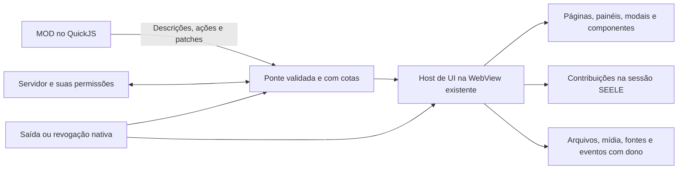

# API de MODs para criar interfaces: proposta e plano de implementação

Data: 20/09/2026. **Proposta a implementar**, baseada no SEELE 0.12.1 e na [auditoria nativa](auditoria-ux-ui-mods-2026-09-20.md). Nomes e exemplos abaixo descrevem o contrato proposto; não são APIs já disponíveis. Este documento orienta a implementação pelo Claude, incluindo adaptações aos módulos reais.

## 1. Decisão de produto

MODs são aplicações e personalizações **de um servidor e das pessoas nele**. Devem poder criar interfaces próprias e transformar a apresentação da sessão. Não são necessariamente widgets, formulários administrativos ou uma faixa na parte inferior.

Preservar QuickJS para lógica e a WebView já existente para apresentação. **Não criar uma WebView, iframe ou processo de navegador por MOD.** Não implementar um navegador ou DOM virtual completo dentro do QuickJS. A aplicação já possui o mecanismo de layout; a API precisa dar acesso mediado às suas capacidades de apresentação.

Separar três responsabilidades:

1. **Criador do MOD:** lógica, composição, linguagem visual, navegação e interações do seu conteúdo.
2. **SEELE:** renderer, integração, foco, recursos, permissões, transporte e encerramento.
3. **Servidor:** identidade, autorização, regras de negócio e dados compartilhados persistentes.

A estética padrão é uma biblioteca útil, não a fronteira de segurança. Cantos arredondados, gradientes, sombras, fontes, cores e animações não devem ser proibidos porque divergem da aparência institucional. As limitações legítimas são alcance, custo, acesso e possibilidade de saída; precisam ser expressas nesses termos.

Atualizar `specs/07-estetica.md`, o contrato de apresentação e os ADRs correspondentes para que não continuem instruindo implementadores a recusar a liberdade solicitada. A marca do aplicativo e suas telas de confiança são distintas da criação do servidor.

## 2. Experiência que a API deve viabilizar

### Estrutura da sessão

```text
┌ Servidor atual                  Voltar à conversa     MODs / diagnóstico ┐
│ Servidores │ Salas e canais │ Área principal                  │ Pessoas │
│            │               │ Conversa OU página de um MOD    │         │
│            │ Aplicações    │                                 │ Cartões │
│            │ • Mesa        │ Conteúdo amplo, navegação própria│ próprios│
│            │ • Perfis      │                                 │         │
│            │               │                                 │         │
│            │ Voz / saída   │                                 │         │
└ Diagnóstico recolhível, sem consumir permanentemente o espaço de criação ┘
```

Esse é o arranjo padrão, não uma grade obrigatória para cada MOD. Uma aplicação pode pedir expansão na área da sessão, painel lateral, diálogo ou conteúdo integrado. A pessoa continua podendo voltar à conversa, acessar voz e sair. A página de um MOD não deve obrigar a desconectar a voz.

**PERFIS:** clicar na pessoa abre um perfil visual com banner, avatar sobreposto, nome, pronomes, status e biografia. “Editar meu perfil” abre modal com campos e prévia lado a lado em janela larga, empilhados em janela estreita. A faixa direita usa a apresentação fornecida pelo MOD, incluindo pessoas fora de sala. Volume/moderação ficam acessíveis sem transformar clicar no nome em uma ação punitiva.

**ESTILO:** “Aparência do servidor” abre editor com amostras, seletor de cor, tipografia, densidade, cantos, sombras e presets. Prévia afeta somente quem edita até publicar. Salvar, cancelar e restaurar têm estados claros. Quem não administra recebe o tema, não um formulário permanente de cores no rodapé.

**MESA:** entrada “Mesa” abre espaço de jogo. Abas/seções para tabuleiro, fichas, compêndio e registro; iniciativa e áudio em painel contextual. Criar campanha, escolher GM/sistema, editar ficha e ajustar cena são diálogos. Imagem de mapa, grade, paredes e peças pertencem ao mesmo plano visual, com zoom/pan e coordenadas consistentes. A conversa e a voz permanecem acessíveis.

## 3. Superfícies e ciclo de navegação

`SeeleUI.superficies.criar(descricao)` devolve um handle vinculado ao MOD, sessão, instância e entidade/contexto. Os métodos locais do handle serializam pedidos; não são objetos DOM.

| Tipo | Uso | Comportamento obrigatório |
|---|---|---|
| `pagina` | Aplicações completas, jogos, diretórios | Ocupa a área principal; título, voltar, rota e estado de navegação próprios |
| `painel` | Inspetor, iniciativa, ferramenta auxiliar | Lado e tamanho ajustáveis; mínimo/máximo declarados; recolhível |
| `dialogo` com `modal: true` | Criar/editar, confirmar, escolher | Fundo inerte, foco contido, título, ação de fechar sempre alcançável |
| `dialogo` com `modal: false` | Ferramenta flutuante durante jogo | Não prende foco; ativação, posição e fechamento previsíveis |
| `popover` | Prévia ancorada, ajuda contextual | Âncora semântica/handle, reposicionamento e fechamento quando âncora sai |
| `menu` | Ações de pessoa/canal/conteúdo | Teclado, grupos, seleção, estados desabilitados e explicações |
| `notificacao` | Resultado breve de ação | Fila limitada, duração e histórico de erros; sem tempestade de avisos |
| `integrada` | Conteúdo em ponto do SEELE | Montada por contrato do ponto de extensão, não por seletor CSS global |

Métodos: `montar(arvore)`, `atualizar(transacao)`, `mostrar()`, `ocultar()`, `fechar(resultado)`, `descartar()`, `aoEvento(fn)`. `fechar` pode manter rascunho lógico conforme política declarada; `descartar` encerra os recursos da superfície. Saída da sessão descarta ambos incondicionalmente.

Propriedades: título/nome acessível, descrição, tamanho inicial/responsivo, largura/altura mínima e máxima, política de rolagem, redimensionamento, contexto, estado sujo, foco inicial e destino de retorno. O host mantém dimensões dentro da área útil: um valor grande não torna o fechamento inalcançável.

Modais suportam cabeçalho, conteúdo, rodapé fixo, múltiplas etapas, progressos, erros por campo e ações personalizadas. Um seletor aberto dentro de um editor tem relação pai/filho explícita. Fechar o pai encerra os filhos. Um diálogo do produto não compartilha a fila de carga que pode estar saturada pelo MOD.

Para modal: foco entra na abertura; Tab/Shift+Tab permanecem nele; Escape solicita fechamento; ao fechar, foco retorna ao acionador ou destino válido. Se há alterações não salvas, o host apresenta a decisão de salvar/descartar; o MOD não pode vetar indefinidamente a saída da sessão. Basear a implementação no [padrão de diálogo da WAI-ARIA APG](https://www.w3.org/WAI/ARIA/apg/patterns/dialog-modal/).

## 4. Composição e estilo: liberdade de verdade

### Primitivas de composição

Oferecer caixa genérica, pilha, linha, grade, divisor, espaçador, rolagem, sobreposição, posicionamento dentro da superfície, proporção e restrições responsivas. Permitir padding, gap, alinhamento, distribuição, crescimento, largura/altura e min/max por componente. `linha` deve de fato ter layout horizontal configurável; converter tudo em `div` sem contrato de layout não basta.

Suportar classes locais e estados `hover`, `focus-visible`, `active`, `disabled`, `invalid`, `selected`, além de consultas de tamanho do contêiner. A medida da janela inteira não basta para um painel redimensionável. O MOD pode combinar primitivas para criar componentes próprios e reutilizá-los em funções JavaScript.

### Estilos de conteúdo próprio

Propriedades declaradas e validadas por categoria: cor e transparência; preenchimento/gradiente; borda e raio; sombra; fonte, peso, tamanho, entrelinha e espaçamento; layout; transformação; recorte; transição e animação. Não limitar o visual de um perfil a seis cores e dois enums.

Recursos visuais usam handles para imagens/fontes/SVG saneado. Nunca interpretar `url(...)`, `@import`, HTML ativo ou seletor externo vindo do MOD como autoridade de rede ou acesso à janela. Valores dinâmicos passam pelo validador do host; um compilador do SDK pode converter uma sintaxe de estilo conveniente em regras declarativas equivalentes. Não usar substituição de texto para tentar tornar CSS arbitrário seguro.

Encapsular regras em uma raiz de apresentação de cada superfície, preferencialmente Shadow DOM quando o protótipo confirmar comportamento e custo nas plataformas. **Shadow DOM é encapsulamento visual, não sandbox de execução.** A fronteira de execução continua sendo QuickJS sem ambiente de navegador e os comandos autorizados no host. Estilos de `:host`, herança, popovers e fontes precisam de contrato explícito; não prometer isolamento só porque existe uma shadow root.

Na interface do SEELE, alterações usam o sistema de contribuições da seção 6. Um estilo da tela do jogo não alcança por acidente a senha da portaria, outro MOD ou a entrada do aplicativo.

### Biblioteca de componentes e escape composicional

A biblioteca padrão acelera projetos simples, mas não é um catálogo fechado de aparências. Toda composição própria pode usar primitivas, estado, eventos e estilos; não deve exigir alterar o SEELE para cada combinação visual nova.

Bibliotecas JavaScript que não dependem do navegador podem ser empacotadas para o QuickJS, com verificação de compatibilidade. Não prometer executar qualquer biblioteca que suponha DOM, Node ou APIs do navegador. SDK pode oferecer compilador de componentes, sem embarcar um framework obrigatório na janela nem uma réplica completa do DOM na VM.

## 5. Controles e interação

| Grupo | Capacidade mínima do contrato |
|---|---|
| Texto | Texto, títulos semânticos, ícones, links mediados, markdown saneado, código, seleção/cópia |
| Ações | Botão com texto/ícone, variante primária/secundária/perigo, toggle, grupo de ações, tooltip e explicação de indisponibilidade |
| Entrada | Texto, textarea, número, slider, checkbox, switch, radio, select, combobox pesquisável, cor, data/hora quando solicitada |
| Formulário | Valores locais, validação síncrona/assíncrona, submit, cancel, dirty, erro por campo, aviso de formulário, foco no erro |
| Organização | Abas, acordeão, árvore, lista/tabela, paginação, ordenação/filtro, seleção simples/múltipla e virtualização quando necessária |
| Pessoas e contexto | Avatar, banner, identidade composta, status, badges e menus de ação |
| Arquivo | Escolha/drop autorizado, finalidade, tipos, tamanho, progresso, cancelamento, prévia e retorno de erro estruturado |
| Mídia | Imagem, áudio/vídeo gerenciados, recorte/posição, controles e estados; sem autorreprodução invasiva |
| Desenho | Camadas 2D, imagem de fundo, caminhos, texto, figuras, hits, seleção, arraste, zoom/pan, transformação e teclado equivalente |

Os widgets compostos mantêm semântica e teclado no host. Abas não podem montar todos os conteúdos pesados antecipadamente só para navegar por setas; escolher ativação manual quando houver custo perceptível, conforme [WAI-ARIA APG — Tabs](https://www.w3.org/WAI/ARIA/apg/patterns/tabs/).

Eventos têm `superficie`, `componente`, `tipo`, `sequencia`, contexto/entidade e dados específicos. Identificadores atravessam a ponte; funções/callbacks permanecem na VM e o SDK os associa localmente. O contrato diferencia clique, submit, alteração local, commit, focus/blur, seleção, composição de texto, arraste e cancelamento. Teclas globais só por registro de atalho e prioridade declarados.

Não mandar uma árvore inteira a cada tecla. A entrada ecoa localmente no host, preservando cursor, seleção e IME; o MOD recebe a alteração e responde com patches/validação. Uma resposta anterior não pode reverter edição mais nova: sequências e versão de campo/contexto fazem parte do protocolo.

Uma transação de UI é validada antes de aplicar. Se não couber ou for inválida, devolver erro com caminho do componente e manter a última tela válida. Evitar pintar metade do formulário, recusar o resto e deixar uma ação aparentemente disponível em estado incoerente.

## 6. Alterar campos e componentes do SEELE

Este é um requisito de primeira classe. Não basta criar conteúdo ao lado de uma linha que continua intocável.

`SeeleUI.contribuicoes.registrar(...)` declara ponto semântico, alvo por ID, modo (`adicionar`, `substituir`, `decorar`), template/componente, prioridade e regras de disponibilidade. O retorno é um handle revogável. Nunca expor `document.querySelector`, seletores de classes internas, `innerHTML` ou CSS global como integração pública.

| Ponto proposto | O MOD pode fazer |
|---|---|
| `pessoa.identidade` | Apresentar nome, avatar, pronomes, status, banner, cor e composição próprios |
| `pessoa.cartao` | Substituir o cartão completo da faixa direita, inclusive hierarquia visual e clique para perfil |
| `pessoa.detalhes` | Acrescentar seções ou fornecer uma página/modal de perfil |
| `pessoa.acoes` | Acrescentar ações contextuais, ficha RPG, mensagem ou outros fluxos autorizados |
| `pessoa.diagnostico` | Reposicionar/recolher sinal e detalhes na composição, mantendo acesso ao diagnóstico nativo |
| `canal.item` e `canal.cabecalho` | Ícone, rótulo de apresentação, badges, descrição, ações e decoração da área |
| `canal.pagina` | Oferecer uma aplicação associada ao canal e alternar com a conversa |
| `mensagem.acoes` e `mensagem.extensao` | Acrescentar ações e conteúdo do próprio MOD; citar sem falsificar autoria original |
| `compositor.ferramentas` | Botões, comandos e seletores que entregam conteúdo para revisão/envio do usuário |
| `sala.cabecalho` e `sala.acoes` | Ferramentas ligadas à sala e conteúdo contextual |
| `servidor.navegacao` | Entradas identificáveis para páginas de MODs |
| `servidor.aparencia` | Tema e apresentação da sessão, incluindo tokens e decoração de componentes expostos |
| `configuracoes.servidor` / `configuracoes.mod` | Páginas de configuração com permissões e escopo claros |

Não congelar a lista nesses nomes: manter registro versionado e documentado de pontos, tipos aceitos, alvo e regras de composição. Novos pontos podem ser adicionados sem abrir acesso indiscriminado ao DOM.

### Campos visuais, dados e autoridade

**Apresentação:** trocar o nome/rosto/cor exibidos do perfil não modifica a chave de identidade. A identidade verificável continua disponível nos detalhes nativos; o host liga as ações ao ID real, nunca ao texto desenhado.

**Dados de MOD:** criar campos personalizados de perfil/campanha/canal é permitido no espaço de dados daquele MOD e servidor, com validação de autoria e regras no servidor. O schema deve poder declarar rótulo, tipo, edição e visibilidade.

**Dados do SEELE:** renomear um canal ou alterar propriedade real usa comando público do núcleo, com autorização do servidor. A contribuição visual não concede esse poder. Permissões se referem a verbos e entidades, não ao fato de um botão estar visível.

### Conflitos e recuperação

Contribuições aditivas convivem em grupos previsíveis. Duas substituições do mesmo ponto precisam de escolha determinística e visível: administrador escolhe o provedor do servidor, com preferência local quando cabível. Nada de “última resposta assíncrona vence”.

Aplicação por camadas/registro, sem salvar `innerHTML` ou copiar valor inicial para restaurar depois. Ao revogar, recalcular a apresentação nativa a partir do estado atual: a pessoa pode ter mudado de sala enquanto o MOD estava aberto.

Disponibilizar “Usar apresentação padrão” e “Desativar interface deste MOD” no controle nativo de MODs. O host sempre pode fechar superfícies, restaurar a navegação, mostrar permissões reais e sair do servidor. Personalização estética pode substituir a faixa de sinal; não pode falsificar autorização, bloquear saída ou encobrir uma confirmação de confiança do produto.

## 7. Estado, transporte e operações confiáveis

- Assinaturas de estado por interesse: pessoas, canal atual, entidade de MOD, voz e visibilidade. Entregar estado inicial + alterações versionadas, evitando três loops de consulta/redesenho permanentes.
- Identidade da execução: servidor/sessão, geração, instância, pacote/hash; escopo adicional de canal/entidade para impedir resposta A desenhar ou gravar em B.
- Separar consulta, mutação e upload. Mutação tem ID estável por tentativa lógica; repetir a mesma operação reutiliza o ID. A revisão de negócio vem do estado da entidade, não de um contador genérico inventado pelo host.
- Oferecer helper do SDK para revisão/conflito/idempotência, mas o servidor continua responsável. Uma resposta perdida não justifica criar duas campanhas.
- Estados de ação: disponível, executando, concluída, falhou, cancelando e cancelada. “Gravado” depende da confirmação do servidor. Botão em progresso impede duplicata conforme regra da operação; mantém feedback visual imediato.
- Erros estruturados com código, mensagem de uso, campos, possibilidade de repetição e detalhes técnicos separados. Exemplo: “Não foi possível criar a campanha. Seus dados continuam no formulário.”; diagnóstico registra o erro original e pedido associado sem conteúdo privado desnecessário.
- Cancelar uma Promise não desfaz uma mutação já confirmada. A resposta deve distinguir cancelamento de espera, operação cancelada e resultado desconhecido.
- Rascunhos pertencem à pessoa, servidor, entidade e superfície. Fechar ou trocar de contexto tem política explícita; nunca transportar rascunho de campanha para outro canal silenciosamente.

Corrigir primeiro MESA para enviar `nonce` e `revision` conforme o contrato existente; a futura API não é desculpa para manter o pacote atual incapaz de escrever.

## 8. Recursos, mídia e desenho

Recursos são handles opacos com origem, proprietário, estado, custo contabilizado e descarte. Pacote do MOD, upload escolhido pela pessoa e dados de servidor são origens distintas. O host valida acesso antes de buscar bytes.

**Arquivos:** informar propósito/tipos/tamanho antes da escolha; ler em blocos; progresso por bytes; cancelamento; liberar handles em sucesso, erro e saída; temporários do servidor com expiração. Dimensionamento/recorte/recompressão de avatar e mapa deve ser serviço gerenciado, evitando multiplicar base64 dentro da VM. Cotas consideram bytes decodificados, dimensões e duração, não apenas tamanho comprimido.

**Mídia:** cache compartilha somente recursos permitidos e com identidade/escopo corretos; buffers da sessão são liberáveis independentemente de cache durável de pacote. Áudio tem iniciar/pausar/parar/volume; acompanhar música compartilhada usa posição e tempo do servidor, sem prometer sincronismo perfeito. Música de MOD não compete sem controle com a voz. Síntese sonora pode ser um serviço próprio mediado se necessária para restaurar a ambientação anterior do MESA.

**Canvas/desenho:** uma cena tem camadas ordenadas (mapa, grade, paredes, peças, seleção), câmera, coordenadas de mundo e hit testing. O renderer executa animação/arraste local suave, enviando eventos limitados e commits de posição; não envia cada pixel pela ponte. Textura/figura fora da vista pode ser descartada/recriada sem perder estado lógico. Oferecer alternativa por teclado para mover/selecionar peças.

**Animação:** presets e keyframes declarativos com duração, repetição, easing e custo. Pausar quando invisível, respeitar redução de movimento, oferecer versão estática. Não fazer um callback QuickJS por quadro para efeitos que a WebView consegue compor sozinha.

## 9. Isolamento por servidor e limpeza

Reutilizar a supervisão, geração, reserva/ativação e revogação nativas existentes. O novo renderer não é motivo para reabrir um executor alternativo.



Ordem de saída:

1. Revogar autoridade na geração correta: nenhuma nova operação da sessão é aceita.
2. Cancelar espera/eventos/assinaturas, fechar superfícies e retirar contribuições; a janela restaura o padrão a partir do estado atual.
3. Parar áudio/animações, liberar URLs, bytes, texturas, estilos/fontes da sessão, seletores pendentes, rascunhos e callbacks de UI.
4. Descartar filas/reservas no host nativo mesmo que a janela não colabore; interromper e confirmar o executor.
5. Só anunciar encerramento completo quando a supervisão tiver a confirmação necessária. Janela travada não pode autorizar efeitos da sessão antiga; sua limpeza visual acontece ao retomar.

**Persistência é explícita:** dados do servidor (perfis, campanhas, temas) sobrevivem. Estado transitório da interface não. Pacotes instalados/cache durável não são “vazamento de MOD” por sobreviverem, mas precisam de política de quota e remoção separada. Não prometer que todo byte do MOD desaparece do computador ao sair.

Contribuição atrasada da instância anterior não fecha nem sobrescreve a superfície nova. Descarte é idempotente e contabilizado por recurso; erro de um descarte não impede os demais. Atalhos nativos de saída e recuperação não ficam na mesma fila de trabalho que pode saturar.

## 10. Leveza sem amputar a criação

“Muitas capacidades disponíveis” não implica criar instâncias de todos os controles. Renderer e componentes são compartilhados; superfícies e mídia são montadas sob demanda.

Orçamento medido separadamente para VM, filas, DOM/layout, imagens decodificadas, áudio/vídeo, GPU quando mensurável e cache. Um heap QuickJS de 8 MiB não é o custo total de um MOD. A implementação atual usa 8 MiB de heap, 64 mensagens/256 KiB por fila e 12 KiB por mensagem; são dados de partida, não autorização para concluir que qualquer UI caberá.

Patches com backpressure, atualizações de estado coalescidas, eventos de interação confiáveis e fila de encerramento independente. Mensagens grandes usam lotes transacionais limitados ou handles, sem uma fila intermediária ilimitada. Nunca resolver uma operação como sucesso antes de aplicar/confirmar o que ela prometeu.

Suspender desenho, animação e consulta de regiões invisíveis. Virtualizar listas grandes; listas pequenas não precisam pagar essa complexidade. Compartilhar fontes/estilos imutáveis quando possível. Rascunho lógico pequeno pode sobreviver à ocultação; mídia pesada não precisa continuar decodificada.

Antes de fixar números novos, medir o app inteiro: sem MOD; três MODs ativos com UI fechada; um editor aberto; perfil com imagens; MESA carregado e em arraste; mesma cena com voz. Registrar plataforma, build, processo/família, método, mediana/picos e retorno após saída. Metas propostas de UX: feedback local imediato e arraste sem travamento perceptível; valores quantitativos de latência/CPU/memória só viram bloqueio após baseline reproduzível. Não usar “CPU zero” quando só houve arredondamento da ferramenta.

Cotas devem limitar trabalho vivo, não o número de funcionalidades do projeto. Expor consumo/recusa ao desenvolvedor e saída clara à pessoa. Exceder orçamento mantém última UI válida e identifica o componente; não desaparece metade de uma ficha.

## 11. API proposta em um exemplo

Exemplo ilustrativo: nomes a consolidar no schema e no SDK, com a mesma semântica. Funções do MOD não atravessam a ponte como código executável na janela.

```js
const tela = await SeeleUI.superficies.criar({
  id: 'criar-campanha',
  tipo: 'dialogo',
  modal: true,
  titulo: 'Criar campanha',
  contexto: { canal: canalId },
  tamanho: { largura: 680, maxLargura: '90%' },
  focoInicial: 'nome',
  fecharComAlteracoes: 'confirmar',
});

await tela.montar({
  tipo: 'formulario', id: 'form', aoSubmeter: 'criar',
  filhos: [
    { tipo: 'texto', texto: 'Esta campanha pertence a este canal.' },
    { tipo: 'campo', id: 'nome', rotulo: 'Nome', obrigatorio: true },
    { tipo: 'selecao', id: 'sistema', rotulo: 'Sistema', opcoes: sistemas },
    { tipo: 'selecao', id: 'gm', rotulo: 'Mestre', opcoes: participantes },
    { tipo: 'acoes', fixas: true, filhos: [
      { tipo: 'botao', texto: 'Cancelar', acao: 'cancelar' },
      { tipo: 'botao', texto: 'Criar campanha', submit: true, variante: 'primaria' },
    ] },
  ],
});

// O evento submit contém valores coerentes do formulário e contexto de origem.
// O SDK pode encapsular o fluxo de progresso, conflito e erro, sem inventar
// campos que o servidor de negócio exige.
tela.aoEvento(async evento => {
  if (evento.acao === 'cancelar') return tela.fechar({ motivo: 'cancelado' });
  if (evento.acao !== 'criar') return;
  await criarCampanhaComEstadoDeAcao(tela, evento.contexto, evento.valores);
});
```

Exemplo de integração: `contribuicoes.registrar({ ponto: 'pessoa.cartao', modo: 'substituir', alvo: { pessoa: id }, conteudo: cartao, acaoPrincipal: 'abrir-perfil' })`. O host preserva o vínculo ao ID real e a disponibilidade dos comandos nativos, mas o layout do cartão pertence ao MOD.

## 12. Mapa de implementação no código

| Camada atual | Trabalho |
|---|---|
| `apps/seele-app/src/executor.rs` | Evoluir prelúdio e mensagens; manter executor único, interrupção e filas com limites |
| `apps/seele-app/ui/mods-runtime.js` e supervisão nativa | Reusar identidade/geração e registro de recursos; acrescentar superfícies/contribuições como recursos filhos |
| `apps/seele-app/ui/base.js` | Separar o roteamento de comandos do gerenciamento de superfícies, temas e contribuições; conferir autoridade antes de efeito |
| `apps/seele-app/ui/mods-regiao.js` | Extrair renderer compartilhado; schemas completos, transações, estilos e widgets; corrigir arquivo já no contrato atual |
| `apps/seele-app/ui/index.html` e `tela-sessao.css` | Hosts de páginas, painéis e camadas; eliminar faixa compulsória; layout responsivo e ações de recuperação |
| `apps/seele-app/ui/tela-sessao.js` | Slots semânticos de pessoas, canais, mensagens e compositor; recompor estado nativo ao retirar MOD |
| `camada-*.js`, `tela-server.js`, `tela-chamada.js` | Compartilhar infraestrutura de foco/camadas, integrar configurações e voz sem duplicar controles |
| `crates/seele-proto/src/mods.rs` + core/FFI/server | Versões suportadas, capacidades e comandos de dados; rever leitura de manifesto explicitamente |
| `api/` | Schema de mensagem, árvore, estilo, evento, contribuição, erro e capacidade; gerar tipos/documentação |
| Três repositórios de MODs | Alterar `ferramentas/*.js`, gerar `cliente/main.js`, corrigir transporte e refazer fluxos visuais |
| `SEELE-MODS-INDEXER/ferramentas/manifesto.py` e catálogo | Compatibilidade real, seleção de pacote por runtime e mensagens de atualização |
| Guia/site, exemplos e preview | Usar o mesmo contrato/renderer, com executor real quando validar runtime; não manter laboratório antigo de Worker como prova |

Novos módulos sugeridos: `mods-superficies.js`, `mods-contribuicoes.js`, `mods-estilos.js`, `mods-componentes.js`. Adaptar os nomes à convenção do projeto; divisão por responsabilidade importa mais que estes nomes. Evitar ampliar indefinidamente `base.js`.

## 13. Compatibilidade e publicação

Recomendação para este redesenho: **API 4 com compatibilidade explícita de leitura/execução da API 3 no novo aplicativo**, usando o mesmo QuickJS e um adaptador de apresentação legado. A API 2 não volta a executar código na janela. API 3 não ganha por acidente permissões/capacidades da 4.

Hoje `read_manifest` exige igualdade com `MOD_API_VERSION`. Portanto, aumentar a constante para 4 por si só quebraria os pacotes 3. Implementar conjunto de versões aceitas e capacidade por versão em todas as camadas, não apenas no cliente JS. O catálogo deve selecionar versão compatível; `api_oferecida` sozinho não é uma negociação, e hoje há comentário no indexador dizendo que esse campo não é usado pelo cliente em produção.

Sem alterar os bytes de um pacote já publicado: novas versões dos três MODs, hashes e assinaturas novos. Manter o pacote API 3 disponível para clientes 0.12.1; antes do novo pacote instalar, mostrar requisito de app/servidor quando necessário. Não inventar aqui o número da próxima release do SEELE.

Sequência: preparar app e MODs candidatos, validar juntos, publicar app compatível com 3/4, só então oferecer pacotes 4 aos clientes capazes. Catálogo/documentação distinguem recursos estáveis, opcionais e não disponíveis. Se a implementação optar por evolução puramente aditiva da API 3, precisa primeiro resolver negociação de capacidades obrigatórias; não deixar clientes antigos aceitarem silenciosamente um pacote que usa métodos inexistentes.

## 14. Execução em entregas fechadas

| Etapa | Entregável | Condição de saída |
|---|---|---|
| A — regressões atuais | Pedidos MESA, rótulos de arquivo, cartões fora de sala, aviso ESTILO, preview/testes coerentes | Pacotes reais executam as ações antes quebradas sem completar pedidos no teste |
| B — UX e superfícies | Navegação de MODs, página/painel, modal com foco, formulário e estilos composicionais | Criar campanha e editar perfil em espaço apropriado no app, com teclado e erro visível |
| C — integração com SEELE | Registro de contribuições, substituição de cartão, ações/contexto, restauração | PERFIS transforma a faixa direita dentro/fora de voz e volta ao padrão ao sair |
| D — três experiências completas | PERFIS visual, ESTILO com prévia e MESA com jogo/mídia | Fluxos abaixo completos com administrador e participante |
| E — custo e encerramento | Medição app inteiro, suspensão, descarte e quotas | Mesmos cenários repetidos sem crescimento contínuo de recursos; voz utilizável sob carga |
| F — SDK e distribuição | Schema, tipos, exemplos, preview, guia e migração | Criador externo monta um MOD sem ler `base.js`; candidatos homologados nas plataformas declaradas |

Não chamar etapas A/B de “API completa”. Não adiar layout, mídia, direitos de edição e estados de erro para depois da publicação. Não abrir rodadas genéricas de novos testes sem mudança ou falha que as justifique.

### Oito jornadas de aceite

1. **Servidor novo:** instalar/ativar os três MODs, entrar e descobrir onde abrir cada um; conversa não perde altura permanentemente por formulários fechados.
2. **PERFIS:** criar perfil, avatar/banner, efeito/cor, editar/cancelar, ver como outra pessoa; cartão na direita dentro e fora de voz, clique abre detalhes e ações nativas continuam acessíveis.
3. **ESTILO:** escolher cores visualmente, prévia local, publicar, ver em segundo cliente, rejeitar dado inválido sem perder rascunho, restaurar padrão e sair sem mudar preferências globais.
4. **MESA:** criar campanha com sistema/GM, cena/mapa, ficha/retrato, peça/parede, dado/iniciativa, compêndio e trilha audível; participante só realiza ações permitidas.
5. **Navegação:** trocar de canal com rascunho, abrir/fechar modal filho, retornar foco, mudar tamanho/zoom, usar só teclado; nenhuma resposta antiga escreve no contexto novo.
6. **Falhas:** erro de servidor, conflito, desconexão, clique duplo, fila cheia, imagem inválida e cancelamento; mensagem útil e estado consistente.
7. **Saída e troca A→B:** durante edição, upload, arraste e áudio; nenhuma UI/estilo/efeito de A aparece em B; dados persistentes de A permanecem no servidor A.
8. **Capacidade e custo:** três MODs com dados representativos, páginas fechadas/abertas, voz ativa e repetição de entradas/saídas; registrar limites e regressões por plataforma.

Essas jornadas podem gerar testes menores por camada, mas cada comportamento precisa terminar em observação nativa. Testes de contrato devem transportar mensagens reais sem preenchê-las artificialmente. Captura bonita não prova gravação; banco alterado não prova que o usuário conseguiu usar a interface.

## 15. O que não deve ser confundido com conclusão

- Corrigir só o `invalid-id` não resolve a UX dos três MODs.
- Aumentar `max-height` da faixa não cria uma API de aplicações.
- Acrescentar um modal rígido sem layout/estilo não restaura liberdade de criação.
- Guardar nome de efeito, tema ou trilha no servidor não prova que eles são desenhados/tocados.
- Dar HTML/CSS/JavaScript irrestrito à janela do produto desfaz a fronteira que foi medida; não é necessário para obter os resultados visuais solicitados.
- Um plano de capacidades extensível não exige prometer “qualquer coisa sem custo”. Exige que novas composições usem primitivas, que limites reflitam recursos e que o criador consiga descobrir/medir o que pode fazer.

O objetivo de aceite é: **os usuários criam experiências reconhecíveis como suas, os três MODs oficiais são bons exemplos dessa liberdade, e o SEELE mantém autoridade e limpeza por servidor sem desperdiçar recursos.**
