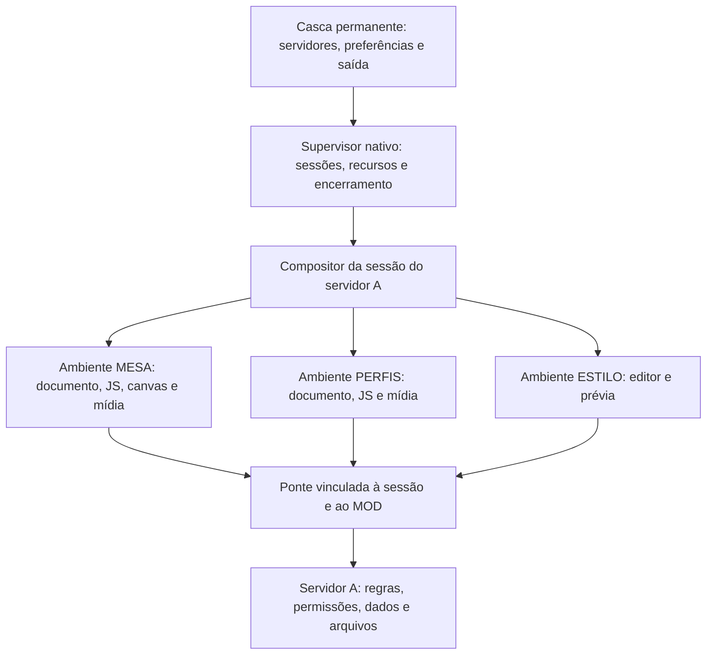

# MODs com liberdade de criação e limpeza garantida por servidor

**Estado: proposta de arquitetura e contrato, não implementada.**
Data: 18/09/2026.
Origem: uso da API 3 na migração de MESA, PERFIS e ESTILO e orientação do responsável pelo SEELE após constatar a perda de funcionalidades.

**Recomendação atualizada:** após a leitura do runtime e a confirmação de que uma API própria é aceitável para priorizar leveza, o caminho principal passou a ser **API visual ampla com renderer compartilhado, comparando Worker e QuickJS**. A análise está em [Opções para MODs livres e leves](opcoes-mods-livres-e-leves.md). Este documento conserva o desenho do candidato com aplicações web isoladas e os requisitos de ciclo de vida; suas exigências de documento web, compatibilidade de navegador e seu plano de implementação não são a escolha atual.

Para implementar a direção atual, ler o [contrato para Claude e seus anexos](contrato-mods-api-propria-para-claude.md), que priorizam reaproveitar a WebView e o Worker existentes, com validação de autoridade e limpeza antes da ampliação visual.

Este documento propõe rever a superfície de apresentação do [ADR 0049](adr/0049-um-mod-deixa-de-rodar-na-janela-do-produto.md), preservando sua exigência de isolamento e encerramento obrigatório. Não altera o status daquele ADR nem publica uma nova API. Todos os métodos e campos identificados como propostos abaixo precisam de implementação, testes e versionamento antes de serem usados em pacotes.

## 1. O contrato com quem cria e com quem entra

**Um MOD pode transformar a experiência dentro de um servidor. Ao sair dele, o SEELE encerra tudo que aquele servidor executava no cliente e devolve a experiência pessoal de quem saiu.**

O servidor escolhe os MODs, suas versões, sua configuração e as combinações de interfaces. Os usuários daquele servidor podem criar conteúdo, jogar, conversar, editar seus perfis e usar as experiências oferecidas, conforme suas permissões. O pacote instalado no computador é um recurso disponível para uma sessão; sua presença em disco não autoriza execução fora dela.

A liberdade pretendida inclui interfaces inteiras, jogos, tabuleiros, animações, temas, imagens, áudio, vídeo, formulários, ferramentas colaborativas e comportamentos que ainda não imaginamos. O autor não precisa pedir uma nova forma de componente à equipe do SEELE sempre que tiver uma ideia.

A fronteira é o servidor e sua sessão. Não é uma lista pequena de estilos permitidos. Um MOD não recebe autoridade sobre o launcher, outros servidores, preferências globais, chaves de identidade ou processos do computador. Essas coisas não pertencem à experiência que aquele servidor pode oferecer.

## 2. O que a migração revelou

Os três clientes anteriores tinham aplicações interativas. A API 3 oferece cinco formas de leitura e quatro tokens de cor. Trocar DOM por essas formas permitiu carregar os pacotes, mas não manter os produtos.

| MOD | O que precisa voltar | Por que a API 3 atual não atende |
| --- | --- | --- |
| MESA | Criar campanhas; editar fichas; rolar dados; arrastar peças; desenhar mapas; importar retratos e cenas; controlar ações, iniciativa e música | Não há entrada, mídia, canvas ou superfície livre |
| PERFIS | Editar textos; enviar imagens; mostrar avatar e banner animado; apresentar perfis na lista de pessoas; manter acesso à moderação e ao estado de voz | Não há formulários, arquivos, mídia ou pontos de apresentação de pessoas |
| ESTILO | Editar e visualizar temas; alterar cores, fontes, densidade, bordas, arredondamento, fundos e efeitos | Quatro cores não representam o tema que o MOD já oferecia |

Os dados e as regras de servidor foram preservados na migração. O cliente perdeu os meios de utilizá-los. Testar que um MOD inicializa e exibe texto não é testar que ele continua funcional.

Acrescentar `botao` e `input` resolveria parte do problema imediato, mas manteria o mesmo teto: cada editor, gráfico, mapa, player ou experiência nova dependeria de a equipe desenhar outra forma. A API precisa oferecer um ambiente de criação, além de componentes prontos opcionais.

## 3. Candidato original: aplicação web própria, descartável

Neste candidato, o cliente de um MOD pode executar uma aplicação web completa em um ambiente isolado, pertencente à sessão. Esse ambiente tem seu próprio documento, seus próprios estilos e JavaScript. O DOM da casca permanente do SEELE continua inacessível. Sua adoção fica condicionada à necessidade de compatibilidade web e às medidas de consumo e isolamento descritas na análise atualizada.

O autor pode usar HTML, CSS, JavaScript, módulos e bibliotecas empacotadas; formulários; SVG; canvas 2D; WebGL; fontes; animações; decodificação de imagens; áudio e vídeo. WebAssembly e APIs aceleradas entram no perfil suportado após validação nos motores atendidos. Compatibilidade de navegador precisa ser documentada; “liberdade” não significa prometer toda API de qualquer navegador em qualquer plataforma.

Framework é escolha do autor. Sem framework também funciona. Build pode ser opcional, com fontes e artefatos finais disponíveis para avaliação; o hash cobre os bytes efetivamente distribuídos. A revisão do pacote precisa adaptar a política de distribuição quando houver fontes, bundles, fontes tipográficas ou WASM, sem executar builds arbitrários no computador de quem instala.

Um Worker continua útil para cálculo, automação e MODs sem interface, mas deixa de ser a única forma de executar um cliente. A interface declarativa de leitura pode continuar como conveniência, sem limitar a aplicação livre.

### 3.1 Separação dos ambientes



O compositor monta as superfícies e as camadas de tema. Ele não executa código de terceiros em seu próprio contexto. Uma contribuição de pessoa ou canal é uma superfície isolada posicionada ali, e não um callback do MOD chamado dentro da página do produto.

### 3.2 A unidade de encerramento precisa existir fora do JavaScript do MOD

**Implementação deste candidato: ambientes web descartáveis com supervisão nativa e fronteira de execução que possa ser encerrada à força.** O desenho original prefere isolamento de execução por MOD; todos os ambientes ficam também agrupados pela sessão. O custo e a composição visual precisam de protótipo.

A casca com o comando de sair não pode compartilhar um loop de execução bloqueável por `while (true)` do MOD. Um processo auxiliar ou grupo de processos supervisionado é candidato a essa fronteira. “Criamos outra WebView” não comprova isso: motores podem compartilhar processos e serviços. O modelo de processos do WebView2 descreve esse compartilhamento; a implementação terá de provar quais recursos consegue encerrar sem atingir a casca ou outra sessão. [Modelo de processos do WebView2](https://learn.microsoft.com/en-us/microsoft-edge/webview2/concepts/process-model).

O protótipo deve decidir o mecanismo concreto em macOS, Windows e Linux. Se as WebViews nativas não oferecerem a fronteira necessária, avaliar um runtime auxiliar com isolamento verificável. O custo de memória, distribuição e composição desse runtime deve ser medido. Não substituir essa verificação por um prazo para chamar `close()`.

Não é necessário criar uma WebView por pessoa presente. Um MOD pode renderizar a lista inteira, virtualizar cartões ou ocupar uma superfície compartilhada de apresentação sob seu próprio runtime. Novas superfícies do mesmo MOD pertencem ao mesmo grupo de descarte; processos adicionais entram no orçamento desse grupo.

### 3.3 O que não satisfaz a garantia sozinho

| Mecanismo | Limitação |
| --- | --- |
| Shadow DOM | Encapsula apresentação, não isola JavaScript, autoridade ou ciclo de vida |
| Prefixos de CSS | Não impedem timers, acesso global, mídia ou tarefas posteriores |
| Evento de unload | O MOD pode ignorá-lo, lançar erro ou travar antes de executá-lo |
| Remover uma tag de script | Não desfaz o código que já executou |
| Iframe de mesma origem | Não estabelece a separação necessária do documento e da autoridade |
| Iframe com sandbox | Pode separar acesso ao DOM, mas sozinho não prova encerramento de todos os recursos nem responsividade da casca |
| Ocultar a superfície | Não encerra execução, sockets, áudio ou recursos nativos |

Um iframe isolado pode ser usado no protótipo ou na composição, mas não será tratado como prova suficiente. Não combinar `allow-scripts` e `allow-same-origin` para conteúdo na origem da casca: a especificação documenta a possibilidade de remoção do sandbox nessa combinação. [HTML: sandbox de iframe](https://html.spec.whatwg.org/multipage/iframe-embed-object.html#attr-iframe-sandbox).

## 4. Liberdade visual e integração com a sessão

### 4.1 Dentro da superfície, o documento é do MOD

O autor controla layout, CSS, eventos, foco interno, formulários, canvas, animações e composição de mídia. Pode construir uma interface que não se pareça com o SEELE. Não precisa converter cada nó para uma árvore de cinco formas.

HTML escrito pelo autor é permitido no seu documento. Texto recebido de participantes continua sendo dado não confiável; a documentação deve ensinar o uso seguro de texto e templating. Permitir HTML do pacote não é recomendar interpretar biografias como HTML.

Pintar de outra cor, usar bordas arredondadas ou animar não exige uma permissão por propriedade. A CSP do ambiente do MOD é própria; ela não exige relaxar a CSP da casca privilegiada. Estilos locais e recursos empacotados devem funcionar sem os contornos CSSOM que os MODs antigos precisaram fazer.

### 4.2 Pontos de apresentação estáveis

O SEELE oferece destinos sem expor seus seletores internos:

| Destino proposto | Uso |
| --- | --- |
| Painel ou aba da sessão | Ferramentas, editores, jogos, documentação |
| Área principal | MESA, quadro colaborativo ou experiência central do servidor |
| Lista de pessoas ou perfil | PERFIS com cartões, banners, estados e ações |
| Lista de canais ou detalhes de canal | Navegação personalizada e metadados |
| Mensagem e composição de mensagem | Conteúdo rico e ferramentas de conversa, sempre com dados autorizados |
| Sobreposição ou diálogo da sessão | Editor de ficha, seleção de imagem, prévia |
| Interface completa da sessão | Servidor que quer refazer a experiência inteira |

Esses destinos não constituem uma lista de widgets permitidos. Cada destino hospeda conteúdo livre. Novos destinos podem evoluir com o produto, mas o autor pode inventar componentes dentro dos destinos existentes sem outra versão da API.

Entregar apenas uma aba lateral não recupera a liberdade anterior. PERFIS precisa substituir a apresentação de pessoas; MESA precisa ocupar a área principal; um MOD deve poder substituir a interface completa do servidor.

Para substituir a sessão inteira, o MOD recebe modelos e ações estáveis do domínio: canais, mensagens autorizadas, participantes, presença, estado de voz e operações permitidas. Ter uma superfície grande sem esses contratos só produziria uma imitação desconectada da sessão.

### 4.3 Identidade, autoridade e ações continuam separadas da aparência

Um cartão personalizado recebe ID estável, identidade apresentada e os dados que aquela pessoa pode ver. Não encontra usuários comparando apelidos no DOM. Ações de moderação consultam a permissão real e são conferidas no servidor, independentemente da aparência do botão.

Uma interface customizada pode reorganizar voz, mensagens e canais. A API de domínio precisa oferecer essas operações por nomes estáveis, com autorização e resultados, sem liberar `invoke` genérico ou objetos internos do produto. Mudar o visual não concede o poder de ler um canal privado ou executar uma ação administrativa.

O servidor seleciona quem ocupa um destino exclusivo. Contribuições adicionais podem conviver, com ordem configurada pelo servidor. Dependências e colisões são resolvidas antes de ativar o conjunto; ordem de chegada não escolhe silenciosamente quem substitui quem.

### 4.4 A saída pertence à casca

Mesmo numa substituição completa, permanecem fora do alcance do MOD uma identificação confiável do servidor e um caminho de sair, silenciar a sessão e recuperar a interface nativa. O atalho de emergência é tratado pela casca ou pelo supervisor, não pelo documento do MOD.

Popups, janelas auxiliares, fullscreen e pointer lock devem permanecer vinculados à sessão. Não podem cobrir ou desativar o mecanismo de saída. A solicitação pode criar uma superfície gerenciada, em vez de uma janela autônoma sem dono.

Se o MOD trava, a pessoa consegue sair ou voltar à apresentação nativa. Recuperar a apresentação não concede autorização para continuar num servidor que exige um conjunto diferente; regras de aceite e conexão continuam valendo.

## 5. ESTILO: temas amplos, sem contaminar a preferência pessoal

Dentro do documento de um MOD, o CSS é livre. Para mudar componentes nativos da sessão, oferecer um contrato de tema mais amplo, aplicado pelo compositor: cores e fundos, gradientes, fontes empacotadas, escalas tipográficas, densidade, espaçamento, bordas, raios, sombras, ícones e movimento.

Os nomes de tema representam propriedades públicas de componentes, não seletores do aplicativo. Expressões de CSS e URLs precisam ser validadas por tipo e por origem do recurso. Não concatenar conteúdo arbitrário de um MOD numa folha global do produto. Quando o contrato temático não for suficiente, a substituição da superfície ou da sessão oferece o caminho livre.

O compositor calcula a aparência a partir de camadas:

1. Preferências atuais da pessoa e aparência base.
2. Tema escolhido pelo servidor, incluindo a composição explícita de contribuições de MODs.
3. Preferências de acessibilidade escolhidas pela pessoa para aquela sessão.

Sair remove as camadas da sessão. Não “restaura” um snapshot antigo das preferências: isso perderia alterações legítimas que a pessoa fez enquanto estava conectada.

Revisar a regra de rejeitar toda paleta abaixo de 4,5:1. A proposta é permitir liberdade estética na experiência customizada, oferecer diagnóstico de contraste e manter opções pessoais de alto contraste, redução de movimento e apresentação nativa. A casca de saída segue legível e independente. O autor decide a arte; quem usa conserva um meio confiável de recuperar legibilidade e parar efeitos.

Dois MODs que alteram o tema não precisam necessariamente ser recusados. O servidor pode escolher um tema ou uma composição ordenada e visível; a prévia mostra o resultado antes de ativá-lo. Nenhum deles grava em preferências globais.

## 6. Contrato proposto da API

Os nomes abaixo são exemplos para discussão. A implementação deve publicar um contrato formal, tipos, erros e testes de conformidade. Não são funções existentes na API 3.

### 6.1 Duas entradas possíveis

Um pacote pode declarar uma página de interface e, opcionalmente, um Worker de cálculo. Pode também continuar sendo somente servidor ou somente Worker. Uma aplicação simples não precisa criar dois runtimes para ter um formulário.

Proposta de manifesto para a próxima versão, ilustrativa:

```json
{
  "schema": 2,
  "api": 4,
  "id": "seele/mesa",
  "version": "3.0.0",
  "repo": "https://github.com/DATA-AND-DEV/MESA",
  "ui": "cliente/index.html",
  "server": "servidor/main.js",
  "reach": ["interface da sessao", "campanha no servidor", "midia da sessao"]
}
```

`schema: 2`, `api: 4` e `ui` são propostos, não valores aceitos atualmente. Confirmar os números na implementação. O campo `client` pode conservar o significado de entrada Worker para pacotes sem página. Não reinterpretar silenciosamente um JS antigo como script privilegiado da janela.

`reach` continua sendo descrição para quem aceita, não concessão técnica de autoridade. O contrato definitivo deve separar requisitos do pacote, autorizações do servidor e permissões da pessoa. A lista de APIs concedidas vem do anfitrião; escrever um alcance no manifesto não libera um dispositivo ou comando.

### 6.2 Superfícies, domínio e dados próprios

| Família proposta | Contrato necessário |
| --- | --- |
| `Seele.sessao` | Contexto somente leitura; ciclo de vida; estado de conexão e canais autorizados |
| `Seele.ui` | Abrir, posicionar, atualizar e fechar superfícies; receber contexto de pessoa/canal; tema e preview |
| `Seele.servidor` | Pedidos privados e assinaturas de estado do próprio MOD, ligados à conexão autenticada |
| `Seele.canais`, `Seele.pessoas`, `Seele.mensagens` | Modelos estáveis e ações do domínio, paginados e autorizados |
| `Seele.arquivos` | Importação por escolha da pessoa, recursos do pacote, upload/download e leitura autorizada do servidor |
| `Seele.audio` e `Seele.video` | Reprodução, mixagem e recursos gerenciados por sessão; integração com voz somente quando autorizada |
| `Seele.tarefas` | Trabalhos e recursos nativos com proprietário, cancelamento e progresso |

Essas famílias não são autorização ampla só por existirem. Cada operação declara alvo, identidade efetiva, efeito persistente ou temporário, limites, erros e momento de cancelamento. A sessão do MOD é implícita na ponte; parâmetros fornecidos pelo MOD não escolhem outra conexão.

Eventos de domínio e assinaturas de dados reduzem a necessidade de consultar tudo a cada dois ou quatro segundos. Precisam de revisão/cursor, ressincronização após perda, filtragem por destinatário e pressão de retorno. O servidor não transmite fichas privadas para todos para depois confiar no filtro visual.

Uma mudança de permissão interrompe ou restringe as assinaturas afetadas. Comunicação entre MODs, quando declarada, usa serviços ou mensagens de sessão com contrato explícito; não dá acesso ao heap, armazenamento ou objetos globais do vizinho.

### 6.3 Exemplo: o formulário é HTML comum

Código ilustrativo dentro de `cliente/index.html`, com JS em arquivo do pacote:

```html
<form id="perfil">
  <label>Nome <input name="nome" maxlength="40"></label>
  <label>Sobre mim <textarea name="bio" maxlength="280"></textarea></label>
  <button type="submit">Salvar</button>
  <p id="status" role="status"></p>
</form>
<script type="module" src="perfil.js"></script>
```

```js
// API proposta; roda no documento isolado do MOD, nunca na casca do SEELE.
const perfil = await Seele.servidor.pedir({ op: "ler-meu-perfil" });
document.querySelector("[name=nome]").value = perfil.nome;
document.querySelector("[name=bio]").value = perfil.bio;
let revisao = perfil.revisao;

document.querySelector("#perfil").addEventListener("submit", async (evento) => {
  evento.preventDefault();
  const form = evento.currentTarget;
  const botao = form.querySelector("button");
  const status = document.querySelector("#status");
  const campos = new FormData(form);
  botao.disabled = true;
  try {
    const salvo = await Seele.servidor.pedir({
      op: "salvar-meu-perfil",
      revisao,
      nome: campos.get("nome"),
      bio: campos.get("bio"),
    });
    revisao = salvo.revisao;
    status.textContent = "Perfil salvo neste servidor.";
  } catch (erro) {
    status.textContent = erro.message;
  } finally {
    botao.disabled = false;
  }
});
```

O contrato de erro desse exemplo rejeita a Promise em falhas do domínio; adapters podem preservar o envelope `ok/error` dos handlers existentes. Os nomes de operação são do exemplo, não uma alteração do handler atual de PERFIS. A identidade e a permissão vêm do servidor. Não há `dispose()` obrigatório: destruir o ambiente elimina o formulário e seus listeners.

## 7. Mídia, arquivos, rede e dispositivos

**Mídia é parte da primeira entrega funcional**, não uma promessa depois de tornar MESA e PERFIS somente leitura.

Recursos do pacote são imutáveis e verificados por hash. Imagens e gravações enviadas pelos participantes ficam no servidor, em arquivos/volumes do MOD. O cliente recebe bytes ou referências temporárias autorizadas; uma URL de recurso não deve servir como permissão global reutilizável em outro servidor.

Uma importação usa um seletor acionado pela pessoa e concede acesso ao arquivo escolhido. Uploads têm limites e autorização de destino; o encerramento cancela a transferência do cliente e invalida seus handles. Um upload incompleto não publica metadados como se tivesse terminado. Reaproveitar a evolução de `volume`, sem fixar nesta proposta a implementação que ainda está em andamento.

Web Audio, elementos de mídia, AudioWorklets, Workers dedicados, fontes, texturas e buffers de GPU precisam estar dentro da unidade de descarte. Não exigir que o autor intercepte cada construtor do navegador ou registre manualmente cada timer. O ambiente web é um recurso supervisionado; recursos abertos no lado nativo são registrados pelo próprio anfitrião.

A saída de áudio passa por um controle de ganho da sessão sob autoridade do supervisor. A saída primeiro fecha esse ganho, incluindo áudio já agendado, e depois destrói os produtores. Captura de microfone, câmera e tela exige autorização da pessoa; tracks e encaminhamentos pertencem à sessão que os abriu. Encerrar um MOD não pode desligar uma captura compartilhada legítima de outra sessão: referências e direitos são separados por proprietário.

Integrações externas são permitidas pelo servidor e declaradas no conjunto aceito. Código remoto executável não substitui silenciosamente os bytes avaliados do pacote. Bibliotecas devem viajar no pacote; dados externos e serviços usam uma API de rede com proprietário e cancelamento. Requisições iniciadas no cliente devem passar por transporte administrado ou por rede do ambiente cuja revogação seja demonstrável. Bloquear apenas `fetch` não basta: mídia, WebSocket, WebRTC, navegação e outros caminhos precisam seguir o mesmo vínculo.

Player remoto, como uma incorporação de vídeo, precisa de um ambiente subordinado gerenciado, sem credenciais ou ponte do MOD pai. Aceitar a integração não contorna políticas do provedor, restrições de incorporação ou permissões do navegador. Não prometer suporte a um serviço antes de testar seu fluxo real.

Service Workers, SharedWorkers persistentes, popups independentes, tarefas em segundo plano e atalhos globais não podem criar uma segunda vida fora da sessão. Devem ser indisponíveis nesse perfil ou substituídos por equivalentes supervisionados. Recursos temporários desse tipo podem ser oferecidos sem autorizar execução global.

## 8. A garantia central: a sessão é dona dos efeitos

### 8.1 Contexto criado pelo anfitrião

```text
ProprietarioDoRecurso = {
  autoridadeAutenticadaDoServidor,
  identidadePersistenteDaInstancia,
  geracaoDaConexaoLocal,
  hashDoConjuntoAceito,
  idDoMod,
  hashDoPacote,
  geracaoDaAtivacaoDoMod
}
```

O anfitrião cria esse vínculo e o associa ao canal IPC real. O MOD não recebe um campo editável com poder de escolher servidor, pessoa, papel ou geração. IDs presentes no corpo são alvos a validar, não prova de autoridade.

Na ponte web, usar um canal dedicado e conferir a identidade do emissor e o contexto de montagem; comparar apenas `event.origin` não basta para distinguir documentos com origem opaca. Uma navegação invalida a ponte anterior e passa por nova autorização do anfitrião. Conteúdo remoto subordinado nunca recebe a ponte do documento pai. A entrega de arquivos também valida pacote, caminho e proprietário; conhecer a URL não autoriza ler bytes privados de outra sessão.

Mesmo servidor, mesmo MOD e mesmo hash após reconectar representam uma nova execução. A geração da ativação também muda quando um MOD é reiniciado dentro da conexão. Nenhum handle da execução anterior pode ser reutilizado.

Não usar somente endereço, ID do MOD ou fingerprint TLS como identidade da instância. O [plano de isolamento](plano-isolamento-mods-por-servidor-2026-09-18.md) já registra por que esses identificadores, isolados, podem coincidir entre instâncias.

### 8.2 Registro de recursos obrigatório no anfitrião

| Recurso | Proprietário | Ação de encerramento |
| --- | --- | --- |
| Documento, JS e CSS do MOD | Ambiente web + ativação | Destruir o ambiente |
| Workers e descendentes | Grupo de execução do MOD | Encerrar o grupo, incluindo descendentes |
| Superfícies, diálogos, tema e apresentação de pessoas | Compositor + sessão | Retirar contribuições pela identidade do proprietário |
| Reprodução, captura e encaminhamento de mídia | Supervisor de mídia + sessão | Silenciar, desvincular e fechar os recursos próprios |
| Pedidos, sockets, streams e transferências | Ponte/transporte + sessão | Revogar, cancelar quando possível, descartar entregas posteriores |
| Arquivos abertos e URLs temporárias | Gestor de recursos + sessão | Fechar handles e revogar acesso |
| Perfil de navegador, caches de dados, cookies e armazenamento web | Ambiente efêmero da sessão | Descartar o perfil; não reutilizar na conexão seguinte |
| Shortcuts, observações e tarefas nativas | Supervisor + ativação | Desregistrar ou cancelar |
| Dados confirmados no servidor | Instância do servidor + MOD | Preservar conforme a regra do MOD |

Todo binding que produz efeito fora do heap do MOD cria o registro **antes** de publicar o handle. Concluir uma abertura depois da revogação deve fechar o recurso recém-criado, não deixá-lo sem proprietário. Falhas parciais de montagem passam pelo mesmo descarte.

Armazenamento web, quando oferecido, é efêmero e particionado por servidor, conexão e MOD. Estado durável de perfil, campanha ou tema continua no servidor. Cache local imutável de pacotes pode sobreviver para economizar downloads, mas não carrega execução, cookies ou acesso ativo.

### 8.3 Ordem de saída

```text
ATIVA → REVOGADA → ENCERRANDO → ENCERRADA
```

1. O supervisor marca a sessão como revogada de forma atômica. A ponte deixa de admitir novas operações e entregas dessa geração.
2. Silencia a saída da sessão, desliga seus encaminhamentos/capturas e remove suas superfícies e tema do compositor. A casca pode mostrar “encerrando” sem executar código do MOD.
3. Cancela transportes e recursos nativos, fecha canais IPC e invalida handles. Tarefas em voo continuam presas ao contexto original.
4. Destrói documentos, Workers e os demais ambientes. Se houver travamento, encerra a unidade de execução supervisionada sem esperar o loop de eventos do MOD.
5. Confere que não restaram recursos ativos desse proprietário. Só então marca a sessão como encerrada. Uma nova sessão não herda nenhuma referência anterior.
6. Descarta armazenamento temporário e registra resultado de limpeza para diagnóstico. Se a remoção física precisar ser repetida, o perfil continua inacessível e nunca volta a ser montado.

O procedimento é idempotente e vale para saída voluntária, troca de servidor, expulsão, término remoto, perda definitiva da conexão, encerramento do app, falha de inicialização, revogação do aceite e troca de conjunto. Reiniciar ou desligar um MOD usa o mesmo mecanismo limitado àquela ativação.

O encerramento não depende de RPC com o servidor, de uma resposta de rede nem de `beforeunload`, `unload` ou promessa do MOD. Um hook de saída pode existir para conveniência, sem autoridade para atrasar a revogação ou garantir gravação de última hora. Salvar precisa acontecer antes da saída, por ação explícita ou política conhecida do MOD.

Cancelamento não substitui conferência de geração. O supervisor verifica a propriedade na recepção, antes de iniciar um efeito, antes de entregar um resultado e antes de instalar uma superfície. A conferência e o efeito precisam ser serializados: verificar “ativa”, liberar o controle e executar depois reabre a corrida.

### 8.4 Saída do servidor e queda transitória

O núcleo define quando uma conexão terminou. Durante uma interrupção temporária, a sessão pode ficar suspensa com indicação visível; seus recursos continuam vinculados ao mesmo servidor e não podem usar outra conexão. Se a reconexão criar uma nova geração, o ambiente anterior é descartado antes de habilitar o novo.

Se o produto oferecer vários servidores simultâneos, cada sessão tem seu grupo de recursos. Sair de A encerra A; B continua apenas porque sua própria sessão segue ativa. Estar em segundo plano não converte um MOD em extensão global.

Na inicialização depois de um crash, o supervisor recolhe ambientes órfãos e perfis temporários. Processos auxiliares precisam de vínculo de vida com o anfitrião, de forma que não continuem executando após ele morrer; arquivos de recuperação por si só não encerram processos.

## 9. O que deve persistir, e o que “limpar” realmente significa

Sair do servidor remove **execução e efeitos temporários naquele cliente**. Não desfaz uma ficha salva, mensagem enviada, rolagem registrada, perfil atualizado ou tema confirmado no servidor. Esses são resultados da participação naquele servidor.

| Situação | Resultado correto |
| --- | --- |
| Pessoa sai durante música da MESA | O áudio para nesse cliente; outros participantes continuam conforme o estado do servidor |
| Pessoa sai após salvar o perfil | O perfil permanece no servidor; nenhum cartão fica no launcher |
| Host fecha sua participação, mas mantém a hospedagem | Os MODs de servidor continuam atendendo os demais participantes |
| Hospedagem é encerrada | Runtimes, tarefas e recursos daquela instância são encerrados; dados duráveis ficam para o próximo boot |
| Resposta de A chega depois de entrar em B | Ela não produz UI, tema, áudio ou escrita através da conexão B |
| Pedido de escrita já foi confirmado no servidor A | O resultado permanece em A, mesmo se o cliente sair antes de recebê-lo |
| Download de pacote já terminou | Os bytes verificados podem ficar no cache, sem executar |

Abortar uma requisição não recolhe bytes já enviados nem desfaz uma transação confirmada. A API precisa distinguir operações ainda canceláveis, operações submetidas e operações confirmadas, usando revisão/recibo quando necessário. Isso evita prometer rollback universal ao sair.

A garantia também não é “RSS volta ao mesmo byte” ou apagamento forense de todo cache do sistema. O requisito verificável é ausência de execução, autoridade, acesso ao estado transitório e efeitos ativos do MOD depois de encerrado. Resíduos temporários inacessíveis devem ter política de coleta, sem serem confundidos com persistência autorizada.

## 10. A metade de servidor continua sendo do servidor

Preservar QuickJS, `aoPedir`, `aoAcontecer`, autorização, dados, arquivos e volumes existentes onde o contrato continua atendendo. O trabalho principal não exige reescrever as regras de RPG ou os perfis.

Uma biblioteca de domínio pode acrescentar ações autorizadas sobre canais, mensagens, pessoas e automações, mas não pode tratar todos os pedidos de participante como administração. Cada operação declara se atua com a autoridade da pessoa autenticada ou com uma autoridade de automação delegada pelo administrador do servidor. Uma delegação não sai num token para o cliente forjar.

Tarefas de servidor têm proprietário pela instância e pelo MOD. Só tarefas explicitamente dependentes da participação de uma pessoa terminam quando ela sai. Um bot, calendário da comunidade ou relógio de campanha pode continuar enquanto a hospedagem e o MOD permanecerem ativos.

Dados e arquivos devem estar isolados por identidade da instância, inclusive quando o mesmo computador hospeda dois servidores e ambos usam o mesmo ID de MOD. Migrações são por servidor; caches de pacote são imutáveis por hash. Um servidor não atualiza silenciosamente o pacote exigido pelo outro.

## 11. Autoridade mínima, capacidade criativa ampla

O aceite informa o conjunto do servidor e seus alcances de forma compreensível: interface completa, mídia, integrações, acesso solicitado a dispositivos. Não há um prompt para cada cor, botão ou listener. Ações de sistema que já exigem gesto ou permissão da pessoa continuam exigindo esse gesto, como escolher um arquivo ou iniciar captura.

O ambiente do MOD não recebe o Tauri global, credenciais internas, filesystem livre ou comandos gerais do aplicativo. A ponte liga capacidades do domínio à sessão real. A configuração atual de `capabilities/janela.json` documenta que comandos próprios precisam de cuidado adicional; capabilities de plugins não são a única barreira. A documentação do Tauri também exige configurar explicitamente o controle de comandos próprios. [Capabilities do Tauri](https://v2.tauri.app/security/capabilities/).

Até a superfície mais livre continua com limites operacionais de CPU, memória, filas, armazenamento e banda. Eles protegem a capacidade de sair e o funcionamento das outras sessões. Orçamentos devem ser medidos com MESA, PERFIS e ESTILO juntos, exibidos no diagnóstico e tratados com erros úteis. Não usar limites minúsculos como uma forma indireta de proibir interfaces ricas.

Não oferecer escapes persistentes, como iniciar processos arbitrários, instalar serviços ou escrever preferências globais, com a justificativa de “liberdade”. Uma experiência por servidor não precisa continuar no computador depois da saída. Quando um uso legítimo precisar de um recurso novo, oferecer um recurso gerenciado com ciclo de vida definido.

## 12. Comparação das alternativas

### 12.1 Baixo consumo é requisito do produto

**Liberdade, limpeza e baixo consumo precisam ser atendidos juntos.** O baixo uso de memória do SEELE é uma característica central, conforme orientação do responsável após a apresentação desta proposta. A recomendação de aplicação web isolada não autoriza adotar um processo ou um ambiente completo por MOD sem medir seu custo.

Não há medição de consumo do runtime proposto. Não há, portanto, um valor em MB ou uma comparação comprovada com Discord a apresentar. Separar instâncias pode acrescentar renderers e, no WebView2, separar pastas de dados pode criar grupos adicionais de processos. A arquitetura deve ser escolhida com esses custos visíveis, não olhando apenas para o processo Rust principal. [Processos e pastas de dados do WebView2](https://learn.microsoft.com/en-us/microsoft-edge/webview2/concepts/process-model).

O protótipo deve comparar pelo menos: Worker com apresentação ampliada gerenciada pelo SEELE; aplicação web isolada aberta sob demanda; composição de ambientes numa infraestrutura de sessão que compartilhe somente recursos que não comprometam autoridade e descarte. O compartilhamento de infraestrutura não implica executar os MODs no mesmo contexto JavaScript nem entregar seus dados uns aos outros.

Uma interface simples de tema não deve pagar obrigatoriamente pelo mesmo ambiente de execução de um tabuleiro 3D. A API própria deve oferecer primitivas amplas e recursos sob demanda. Um documento web completo só deve ser acrescentado se houver uma necessidade que justifique o custo; leveza não pode ser obtida reduzindo novamente os MODs a leitura de texto.

Requisitos de implementação:

- Sem sessão ativa, nenhum ambiente de MOD em execução. O cache de pacotes pode permanecer em disco.
- Interfaces pesadas abrem quando necessárias; fechar uma interface libera seus recursos próprios, preservando somente atividades de sessão explicitamente necessárias.
- Um cartão não cria um navegador próprio. Listas precisam de composição e virtualização proporcionais ao conteúdo visível.
- Imagens decodificadas, buffers, texturas e mídia têm orçamentos próprios; suspender pintura não é liberar esses recursos.
- Não incluir outro motor de navegador no produto antes de demonstrar por que os motores disponíveis não atendem e medir o custo adicional.

Medir o mesmo build, máquina, conteúdo e atividade em seis cenários: sem MODs; três MODs carregados em repouso; editor de ESTILO/PERFIS aberto; MESA em uso; mídia e mapas no pior caso declarado; saída após 100 ciclos. Comparar com o SEELE sem a nova infraestrutura e com os clientes completos anteriores quando executáveis no laboratório. A versão reduzida somente de leitura não é uma referência funcional equivalente.

O relatório deve incluir memória total atribuível ao aplicativo, incremento por ambiente e por MOD, pico de memória, CPU, GPU quando mensurável, tempo de entrada e consumo após sair. Identificar a métrica em cada sistema: somar RSS de todos os processos pode contar páginas compartilhadas mais de uma vez. Usar métricas de memória privada/proporcional ou footprint conforme o sistema, documentando as diferenças.

Antes de escolher a arquitetura, fixar um orçamento numérico de incremento em repouso e em uso com base nessas medições. Se a proposta ultrapassar o orçamento, revisar a implementação. Não aceitar aumento indefinido sob o argumento de que MODs podem consumir qualquer quantidade de recursos. Nenhuma estimativa deste documento substitui o protótipo.

### 12.2 Alternativas a medir

| Alternativa | Liberdade | Limpeza sem cooperação | Avaliação |
| --- | --- | --- | --- |
| JS na casca permanente | Alta | Não há como prometer para efeitos arbitrários | Não recuperar esse desenho |
| API 3 com mais algumas formas | Limitada à gramática | Boa para os recursos atuais gerenciados | Útil como caminho simples, insuficiente como teto |
| DOM inteiro por mensagens a um renderer próprio | Potencialmente ampla | Possível com proprietário completo | Custo alto para reproduzir comportamento de navegador, bibliotecas, eventos e mídia |
| Aplicação web isolada com supervisão nativa | Alta dentro da experiência do servidor | Exigida e demonstrada pelo encerramento do ambiente e de seus recursos | Recomendação |

Nenhuma opção obtém a garantia apenas por seu nome. A recomendação depende do protótipo comprovar encerramento forçado, isolamento de IPC, mídia e armazenamento. Se não comprovar, essa implementação não está pronta para substituir a atual.

## 13. Plano de implementação

### Etapa 1 — fechar a fronteira de execução

Criar um protótipo com documento livre, formulário, animação, canvas, áudio agendado, Worker descendente e um laço infinito. Medir isolamento, composição e descarte em macOS, Windows e Linux, com as versões mínimas realmente suportadas pelo SEELE.

Decidir: biblioteca/motor, fronteira de processo, armazenamento efêmero, bloqueio de IPC geral, supervisão de mídia e destruição de descendentes. Demonstrar que o comando de sair continua respondendo durante o travamento. A prova precisa ocorrer no app nativo; uma página no Chromium de desenvolvimento não basta.

### Etapa 2 — implementar a sessão como proprietária

Identidade autenticada de instância, gerações, canais IPC vinculados, registro de recursos, revogação atômica e encerramento único. Exercitar corridas de montagem, respostas, uploads e troca de servidor antes de ampliar a superfície.

### Etapa 3 — entregar liberdade de apresentação

Página de MOD, recursos empacotados, formulários, canvas, mídia e superfícies. Acrescentar apresentação de pessoas/canais, domínio autorizado e substituição da sessão. Temas amplos e prévia usam o mesmo compositor e o mesmo descarte.

### Etapa 4 — recuperar os três MODs completos

Restaurar as capacidades da tabela da seção 2 a partir das implementações anteriores. Manter regras, armazenamento, IDs e permissões; adaptar montagem, recursos e ponte. Não aceitar uma tela informando “aguardando suporte” como migração concluída.

Testar os três juntos, além de um MOD experimental que use uma interação diferente dos exemplos, como desenho colaborativo com arraste e atalhos locais. Isso confere se foi entregue um ambiente criativo, e não três exceções feitas à mão.

### Etapa 5 — versão, guia e distribuição no mesmo passo

Publicar contrato novo, versão do manifesto quando necessária, implementações de runtime, catálogo/indexador, exemplo completo e guia de autoria. O guia deve usar formulários, mídia, superfície livre e descarte; o exemplo exclusivamente de leitura não basta para validar essa API.

API 2 não volta a executar na casca. Um eventual adapter roda dentro do novo ambiente e não promete compatibilidade com seletores internos antigos. A continuidade de pacotes API 3 pode ser oferecida explicitamente mantendo seus quatro métodos num ambiente isolado; exige ajustar a política atual de igualdade da versão da API, com testes. Não basta mudar o número do manifesto.

A entrega deve informar capacidades recuperadas por MOD. Não publicar a substituição da arquitetura como pronta enquanto recursos essenciais forem removidos sem uma decisão explícita de escopo.

## 14. Critérios de aceite

### Funcionalidade

- MESA cria campanha, edita ficha, rola dados, move peça, importa/exibe mapa e retrato, controla iniciativa e reproduz/pausa música para a sessão.
- PERFIS edita textos, envia e mostra avatar/banner animado, personaliza a apresentação de pessoas e mantém identidade, moderação e voz utilizáveis.
- ESTILO edita, mostra prévia e aplica o conjunto ampliado de aparência sem gravar preferências globais.
- Um MOD oferece uma interface completa da sessão com ações autorizadas de domínio e saída independente.
- Dois servidores podem exigir hashes diferentes do mesmo MOD sem substituir arquivos ou dados um do outro.

### Limpeza e isolamento

| Teste | Resultado exigido |
| --- | --- |
| Sair com timer, animação, áudio agendado e Worker filho | Nenhuma execução ou saída de mídia permanece vinculada à sessão encerrada |
| MOD ignora unload ou lança erro na inicialização | O supervisor encerra todos os recursos criados, inclusive os de montagem parcial |
| Laço infinito na UI do MOD | A casca aceita a saída; encerramento forçado não depende do laço |
| Rede lenta conclui abertura depois da revogação | O recurso é fechado sem ser entregue; nada reaparece |
| A → B com mesmos ID, hash e revisão de dados | B usa uma geração nova e dados de B; nenhum efeito de A é reutilizado |
| Reiniciar um MOD dentro da sessão | Handles da ativação anterior são recusados |
| Acesso direto a Tauri, IPC ou dados do vizinho | Recusa independente de o MOD conhecer nomes e formatos internos |
| Service Worker, SharedWorker ou popup tentando sobreviver | Criação recusada ou recurso encerrado como parte do grupo gerenciado |
| Entrar/sair 100 vezes com os três MODs | Zero recursos ativos órfãos; consumo estabiliza dentro de orçamento medido |
| Crash do anfitrião e reabertura | Auxiliares não continuam ativos; perfis anteriores não são remontados |
| Trocar preferência pessoal durante a sessão | Ao sair, aparece a preferência pessoal atual |
| Pessoa sai e outros continuam no servidor | Som e UI param só no cliente que saiu; estado e funcionamento dos demais são preservados |

O diagnóstico deve expor, por sessão e por MOD, ambientes, superfícies, saídas de áudio, capturas, tarefas, streams, handles e gerações. Sem essa observabilidade, “não sobrou nada” vira inspeção visual insuficiente.

**Metas iniciais para o protótipo, não garantias já medidas:** silenciar e retirar a apresentação em até 100 ms do comando local de saída; concluir encerramento forçado de execução em até 1 s; nenhum recurso ativo após o estado `ENCERRADA`. Medir p95 e pior caso, incluindo saturação de CPU. Ajustar e publicar metas somente com evidência nos alvos suportados. A coleta física de cache pode ocorrer depois, mantendo-o inacessível.

O aceite exige duas propriedades simultâneas: **o MOD conserva sua capacidade de criação dentro do servidor; o cliente não conserva sua execução ou seus efeitos temporários depois de sair.**

## 15. Referências e base da proposta

Base local: SEELE em `969e763`, com alterações em andamento no checkout, e experiência da migração dos três MODs. Esta análise não homologa os trabalhos paralelos de protocolo, volume ou isolamento. As recomendações de novo runtime ainda precisam dos experimentos descritos acima.

- [ADR 0045: liberdade dos MODs e pertencimento ao servidor](adr/0045-mods-o-produto-base-tem-regras-e-um-mod-nao.md).
- [ADR 0049: isolamento, Worker e ruptura na API 3](adr/0049-um-mod-deixa-de-rodar-na-janela-do-produto.md).
- [Plano de isolamento por servidor](plano-isolamento-mods-por-servidor-2026-09-18.md).
- [Guia atual de migração API 2 → 3](migracao-de-mods-api-2-para-3.md).
- [Runtime atual de cliente](../apps/seele-app/ui/base.js) e [capacidades da janela](../apps/seele-app/capabilities/janela.json).
- [WHATWG: encerramento de Workers](https://html.spec.whatwg.org/multipage/workers.html#terminate-a-worker). O encerramento desse contexto não é um contrato automático de cancelamento de uma transação ou de um recurso nativo criado por outro processo.

As referências técnicas externas sustentam as distinções de isolamento descritas neste documento. A arquitetura proposta e os critérios de aceite são decisões recomendadas para o SEELE, não garantias fornecidas prontas por essas bibliotecas.
